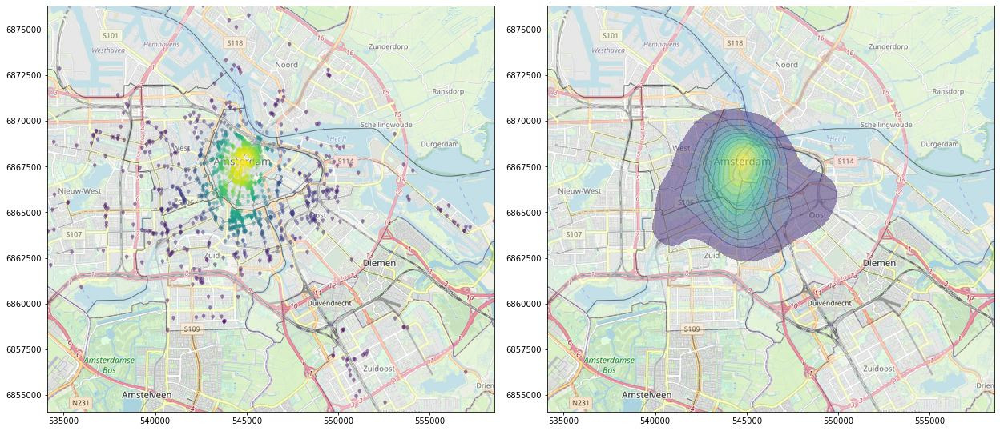

This tutorial teaches you how to plot map data on a background map of OpenStreetMap using Python. So far, I have most often used `QGIS` or `R` for my mapping needs, but since I spend around 99% of my programming time with Python, I was wondering if there is a simple way to create good looking maps through Python. As a data source, we use points of interest (POI) information about the city of Amsterdam. Specifically, we want to plot the restaurants and their spatial density on a map. We also use a polygon-shape file of the city to remove any points that lie outside the city borders. The results of this tutorial should look like the following images:

## Installation

This tutorial requires the installation of multiple packages; a few of them are not installable for Windows under `PyPI`. You can start by cloning the GitHub repo for this tutorial:


git clone https://github.com/InformationSystemsFreiburg/map_creation_amsterdam_python


The following packages you need to install as wheels. You find them in the `package_wheels_windows` folder:


FionaGDAL
Rtree
Shapely


can be installed as wheels with this code:


pip install .\package_wheels_windows\Fiona-1.8.9-cp37-cp37m-win_amd64.whl
pip install .\package_wheels_windows\GDAL-3.0.1-cp37-cp37m-win_amd64.whl
pip install .\package_wheels_windows\Rtree-0.8.3-cp37-cp37m-win_amd64.whl
pip install .\package_wheels_windows\Shapely-1.6.4.post2-cp37-cp37m-win_amd64.whl

After that, the rest of the packages should be easily installable by using the provided `requirements.txt` file:


pip install -r requirements.txt


## Importing packages

We need to import quite a few packages before we can start:


import numpy as np 
import pandas as pd
import geopandas as gpd 
from scipy.stats import gaussian_kde
import matplotlib.pyplot as plt
from matplotlib.font_manager import FontProperties
from matplotlib.path import Path
from matplotlib.textpath import TextToPath
import tilemapbase
import warnings
import matplotlib.cbook
warnings.filterwarnings("ignore", category=matplotlib.cbook.mplDeprecation)

import seaborn as sns
import shapely.speedups
shapely.speedups.enable()


Download the following data and extract it into the ./data folder of this project:

- [Points of interest data from North Holland](http://download.geofabrik.de/europe/netherlands/noord-holland-latest-free.shp.zip)
- [City boundaries as GeoJSON](https://maps.amsterdam.nl/open_geodata/geojson.php?KAARTLAAG=GEBIED_STADSDELEN&THEMA=gebiedsindeling)

You also have to unzip the `noord-holland-latest-free.shp.zip`.

## Loading and preprocessing the data

Load the POI data. For the plotting package `tilemapbase` our data needs to be in the coordinate reference system (CRS) `EPSG:3857`, therefore we have to convert our location data accordingly.

points = gpd.read_file("./data/gis_osm_pois_free_1.shp")
points = points.to_crs({"init": "EPSG:3857"})


Filter the data for restaurants (or any other POI category):


points = points[points["fclass"] == "restaurant"]

take a quick look into the data

print(points)


| osm_id | code       | fclass | name       | geometry           |                                |
|--------|------------|--------|------------|--------------------|--------------------------------|
| 92     | 30839687   | 2301   | restaurant | de Eethoek         | POINT (521775.259 6910003.671) |
| 144    | 34043796   | 2301   | restaurant | Sizzling Wok       | POINT (550760.350 6853264.008) |
| ...    | ...        | ...    | ...        | ...                | ...                            |
| 37100  | 7126562155 | 2301   | restaurant | Duinberk           | POINT (522497.422 6928134.759) |
| 37111  | 7137254485 | 2301   | restaurant | Vleesch noch Visch | POINT (542280.944 6869060.363) |

Looks good so far! Now to load the shapefile for the city of Amsterdam in a similar manner as before:

city = gpd.read_file("./data/geojson.json")
city = city.to_crs({"init": "EPSG:3857"})

take a quick look into this data as well

print(city)

| Stadsdeel_code | Stadsdeel | Opp_m2     | geometry |                                                   |
|----------------|-----------|------------|----------|---------------------------------------------------|
| 0              | A         | Centrum    | 8043500  | POLYGON ((549136.599 6867376.523, 549133.148 6... |
| 1              | B         | Westpoort  | 28991600 | POLYGON ((543892.115 6872660.218, 543540.457 6... |
| 2              | E         | West       | 10629900 | POLYGON ((544918.815 6870710.847, 544873.285 6... |
| 3              | F         | Nieuw-West | 38015500 | POLYGON ((539955.524 6866252.019, 539951.183 6... |
| 4              | K         | Zuid       | 17274000 | POLYGON ((547134.629 6862225.476, 547129.731 6... |
| 5              | M         | Oost       | 30594900 | POLYGON ((560946.039 6864490.649, 560918.543 6... |
| 6              | N         | Noord      | 63828800 | POLYGON ((565410.507 6870704.099, 564865.041 6... |
| 7              | T         | Zuidoost   | 22113700 | POLYGON ((558996.500 6854997.221, 558987.372 6... |

This data looks fine as well! Now we need to remove any points that lie outside the city boarders. For this, we perform a spatial join between the points and polygons and filter out any points that did not match with the polygons. After the join, we drop any points that have not gained an `ìndex` from the polygons, which means the specific points lie outside the city boarders:

points = gpd.sjoin(points, city, how="left")
points = points.dropna(subset=["index_right"])

With spatial data we always have the luxuary to plot the data tosee if our preprocessing is done correctly:

# edit the figure size however you need to
plt.figure(num=None, figsize=(10,10), dpi=80, facecolor='w', edgecolor='k')
# create plot and axes
fig = plt.plot()
ax1 = plt.axes()
# these values can be changed as needed, the markers are LaTeX symbols
city.plot(ax=ax1, alpha=0.1, edgecolor="black", facecolor="white")
points.plot(ax=ax1, alpha = 0.1, color="red", marker='$\\bigtriangledown$',)
ax1.figure.savefig('./data/plot1.png', bbox_inches='tight')


The data seems has been joined as expected! But this map still looks quite ugly, so we should improve it by adding a base map.

## Add a background map to the plot

To get a nice background map, we need to find out all the boundaries of our data and save that for later plotting

bounding_box = [points["geometry"].x.min(), points["geometry"].x.max(), points["geometry"].y.min(), points["geometry"].y.max()]

load the background map using `tilemapbase`

tilemapbase.start_logging()
tilemapbase.init(create=True)
extent = tilemapbase.extent_from_frame(city, buffer = 25)

OK, now we can continue with the plotting. We need to set the limits of the axes according to the bounding boxes. For zooming, we can either add or subtract frrom the first values in `set_xlim` and `set_ylim`.

fig, ax = plt.subplots(figsize=(10,10))
plotter = tilemapbase.Plotter(extent, tilemapbase.tiles.build_OSM(), width=1000)
plotter.plot(ax)
ax.set_xlim(bounding_box[0]+2000, bounding_box[1])
ax.set_ylim(bounding_box[2]+2000, bounding_box[3])
city.plot(ax=ax, alpha=0.3, edgecolor="black", facecolor="white")
points.plot(ax=ax, alpha = 0.4, color="red", marker='$\\bigtriangledown$',)
ax.figure.savefig('./data/plot1.png', bbox_inches='tight')


The map looks great! We want to show the data in a few different kinds of plots, but since most code will be reused, we might as well create a small function:


def plot_map(fig, ax, points_plot, polygons_plot, file_name):
    """A short helper function that takes points and polygons as input and creates a plot with a basemap."""
    plotter = tilemapbase.Plotter(extent, tilemapbase.tiles.build_OSM(), width=1000)
    plotter.plot(ax)
    ax.set_xlim(bounding_box[0]+2000, bounding_box[1])
    ax.set_ylim(bounding_box[2]+2000, bounding_box[3])
    polygons_plot
    points_plot
    ax.figure.savefig(f'./data/{file_name}.png', bbox_inches='tight')

## Show a KDE plot of the spatial distribution

If we want to get an impression on the spatial distribution, a KDE plot might help. For this, we use the `kdeplot`-function from `seaborn`.


fig, ax = plt.subplots(figsize=(10,10))
density_plot = sns.kdeplot(
                    points["geometry"].x, 
                    points["geometry"].y, 
                    shade=True, 
                    alpha=0.5, 
                    cmap="viridis", 
                    shade_lowest=False, 
                    zorder=3
                    )
plot_map(fig, ax, density_plot, city_boarders, "plot3")


## Color the markers with the KDE information

Instead of drawing the KDE as a single shape, we can also color our points according to the density. For this we calculate the gaussian KDE separately and use the result as z-values for our plot. The markers can be changed to ones liking, for this case I settled with simple points:

xy = np.vstack([points["geometry"].x,points["geometry"].y])
z = gaussian_kde(xy)(xy)


fig, ax = plt.subplots(figsize=(10,10))
points_density = ax.scatter(
                        points["geometry"].x, 
                        points["geometry"].y, 
                        c=z, 
                        s=20, 
                        edgecolor='',  
                        alpha=0.7, 
                        zorder=3
                        )
plot_map(fig, ax, points_density, city_boarders, "plot4")


## Use more specific symbols as map markers

If you want to change the markers in the map to more sophisticated ones, you could also use Font Awesome. Download the font from here and save it to `/resources/`. Edit the `symbols` dict to add symbols that might fit your subject, a cheat sheet for the Unicode characters you can find on [the fontawesome website](https://fontawesome.com/cheatsheet). Just add a `\u` to any of the Unicode characters.

fp = FontProperties(fname=r"./resources/Font Awesome 5 Free-Solid-900.otf") 

def get_marker(symbol):
    """Extracts the symbol from the font."""
    v, codes = TextToPath().get_text_path(fp, symbol)
    v = np.array(v)
    mean = np.mean([np.max(v,axis=0), np.min(v, axis=0)], axis=0)
    return Path(v-mean, codes, closed=False)

symbols = dict(map = "\uf041", map_alt = "\uf3c5")

We can now use these markers with the command `get_marker(symbols["map"])`

fig, ax = plt.subplots(figsize=(10,10))
points_with_markers = ax.scatter(
                            points["geometry"].x, 
                            points["geometry"].y, 
                            c="red", 
                            s=35, 
                            zorder=2, 
                            edgecolor='', 
                            alpha=0.5, 
                            marker=get_marker(symbols["map"])
                            )
plot_map(fig, ax, points_with_markers, city_boarders, "plot5")


This looks pretty good! And of course we can also combine the densty from before to make the final map:


fig, ax = plt.subplots(figsize=(10,10))
points_with_markers_density = ax.scatter(
                                    points["geometry"].x, 
                                    points["geometry"].y,
                                    c=z, 
                                    s=45, 
                                    zorder=2, 
                                    edgecolor='',  
                                    alpha=0.5, 
                                    marker=get_marker(symbols["map"])
                                    )
plot_map(fig, ax,points_with_markers_density, city_boarders, "plot6")


With this last map, we conclude this short tutorial into mapping with Python.