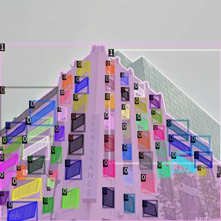

This tutorial teaches you how to implement instance image segmentation with a real use case. I have written this tutorial for researchers that have fundamental machine learning and Python programming skills that want to implement instance image segmentation for further use in their urban energy simulation models.  `detectron2` is still under substantial development and as of January 2020 usable with Windows without some code changes [that I explain in more detail on this GitHub Repository](https://github.com/InformationSystemsFreiburg/image_segmentation_japan). Instead of using `detectron2` on a local machine, you can also use Google Colab and a free GPU from Google for your models. The GPU is either an Nvidia K80, T4, P4, or P100, all of which are powerful enough to train `detectron2` models. **Important note: Computation time on Google Colab is limited to 12 hours**.

The first part of this tutorials is based on the beginners' tutorial of `detectron2`, the second part and third part come from the research stay of [Markus Rosenfelder](https://www.is.uni-freiburg.de/mitarbeiter-en/team/markus-rosenfelder) at [GCP NIES](https://www.cger.nies.go.jp/gcp/) in Tsukuba.

## Part 1 Installation and setup

### Installation within Google Colab 

First, check what kind of GPU Google is providing you in the current session. You find the GPU model name in the third row of the first column.

```bash
!nvidia-smi
```

```bash

    Wed Jan 29 07:35:39 2020       
    +-----------------------------------------------------------------------------+
    | NVIDIA-SMI 440.44       Driver Version: 418.67       CUDA Version: 10.1     |
    |-------------------------------+----------------------+----------------------+
    | GPU  Name        Persistence-M| Bus-Id        Disp.A | Volatile Uncorr. ECC |
    | Fan  Temp  Perf  Pwr:Usage/Cap|         Memory-Usage | GPU-Util  Compute M. |
    |===============================+======================+======================|
    |   0  Tesla T4            Off  | 00000000:00:04.0 Off |                    0 |
    | N/A   38C    P8     9W /  70W |      0MiB / 15079MiB |      0%      Default |
    +-------------------------------+----------------------+----------------------+
                                                                                   
    +-----------------------------------------------------------------------------+
    | Processes:                                                       GPU Memory |
    |  GPU       PID   Type   Process name                             Usage      |
    |=============================================================================|
    |  No running processes found                                                 |
    +-----------------------------------------------------------------------------+
```

Now onto the installation of all needed packages. Please keep in mind that this takes a few minutes.

```python
# install dependencies:
# (use +cu100 because colab is on CUDA 10.0)
!pip install -U torch==1.4+cu100 torchvision==0.5+cu100 -f https://download.pytorch.org/whl/torch_stable.html 
!pip install cython pyyaml==5.1
!pip install -U 'git+https://github.com/cocodataset/cocoapi.git#subdirectory=PythonAPI'
import torch, torchvision
torch.__version__
!gcc --version
# opencv is pre-installed on colab
```

```python
# install detectron2:
!git clone https://github.com/facebookresearch/detectron2 detectron2_repo
!pip install -e detectron2_repo
```

```python
# You may need to restart your runtime prior to this, to let your installation take effect
# Some basic setup:
# Setup detectron2 logger
import detectron2
from detectron2.utils.logger import setup_logger
setup_logger()

# import some common libraries
import numpy as np
import cv2
import random
from google.colab.patches import cv2_imshow

# import some common detectron2 utilities
from detectron2 import model_zoo
from detectron2.engine import DefaultPredictor
from detectron2.config import get_cfg
from detectron2.utils.visualizer import Visualizer
from detectron2.data import MetadataCatalog
```

### Running a pretrained model

In this chapter, we run inference on a pretrained and prelabeled model to see if our setup has been successful so far. For this, we download an image and run inference on it.

```bash
!wget http://images.cocodataset.org/val2017/000000439715.jpg -O input.jpg
```

```bash
    --2020-01-29 06:12:27--  http://images.cocodataset.org/val2017/000000439715.jpg
    Resolving images.cocodataset.org (images.cocodataset.org)... 52.216.185.99
    Connecting to images.cocodataset.org (images.cocodataset.org)|52.216.185.99|:80... connected.
    HTTP request sent, awaiting response... 200 OK
    Length: 209222 (204K) [image/jpeg]
    Saving to: ‘input.jpg’
    
    input.jpg           100%[===================>] 204.32K  --.-KB/s    in 0.09s   
    
    2020-01-29 06:12:28 (2.32 MB/s) - ‘input.jpg’ saved [209222/209222]
```

```python
im = cv2.imread("./input.jpg")
cv2_imshow(im)
```


```python
cfg = get_cfg()
# add project-specific config (e.g., TensorMask) here if you're not running a model in detectron2's core library
cfg.merge_from_file(model_zoo.get_config_file("COCO-InstanceSegmentation/mask_rcnn_R_50_FPN_3x.yaml"))
cfg.MODEL.ROI_HEADS.SCORE_THRESH_TEST = 0.5  # set threshold for this model
# Find a model from detectron2's model zoo. You can use the https://dl.fbaipublicfiles... url as well
cfg.MODEL.WEIGHTS = model_zoo.get_checkpoint_url("COCO-InstanceSegmentation/mask_rcnn_R_50_FPN_3x.yaml")
predictor = DefaultPredictor(cfg)
outputs = predictor(im)
```

```bash
    model_final_f10217.pkl: 178MB [00:10, 16.6MB/s]
```

```python
# look at the outputs. See https://detectron2.readthedocs.io/tutorials/models.html#model-output-format for specification
outputs["instances"].pred_classes
outputs["instances"].pred_boxes
```

```bash
    Boxes(tensor([[126.6035, 244.8977, 459.8291, 480.0000],
            [251.1083, 157.8127, 338.9731, 413.6379],
            [114.8496, 268.6864, 148.2352, 398.8111],
            [  0.8217, 281.0327,  78.6072, 478.4210],
            [ 49.3954, 274.1229,  80.1545, 342.9808],
            [561.2248, 271.5816, 596.2755, 385.2552],
            [385.9072, 270.3125, 413.7130, 304.0397],
            [515.9295, 278.3744, 562.2792, 389.3802],
            [335.2409, 251.9167, 414.7491, 275.9375],
            [350.9300, 269.2060, 386.0984, 297.9081],
            [331.6292, 230.9996, 393.2759, 257.2009],
            [510.7349, 263.2656, 570.9865, 295.9194],
            [409.0841, 271.8646, 460.5582, 356.8722],
            [506.8767, 283.3257, 529.9403, 324.0392],
            [594.5663, 283.4820, 609.0577, 311.4124]], device='cuda:0'))
```

```python
# We can use `Visualizer` to draw the predictions on the image.
v = Visualizer(im[:, :, ::-1], MetadataCatalog.get(cfg.DATASETS.TRAIN[0]), scale=1.2)
v = v.draw_instance_predictions(outputs["instances"].to("cpu"))
cv2_imshow(v.get_image()[:, :, ::-1])
```


## Part 2 - Training and Inferencing (detecting windows and buildings)

### Creating a custom dataset with VGG Image Annotator

Before continuing with programming, one important step has to be learned: how to annotate images efficiently. For this, we will use the [VGG Image Annotator](http://www.robots.ox.ac.uk/~vgg/software/via/via.html). Please keep in mind that you can also [download the annotator](http://www.robots.ox.ac.uk/~vgg/software/via/) for free and use it from your local machine.

On your local machine, do the following:

- Create a folder named `buildings`.
- within this folder, create two folders: `val` and `train`.
- Open the `VGG Annotator` either locally or via the URL mentioned above.
- Short introductions on how to use the tool:
  - Go to settings and specify the default path to where your train folder is located, example: `../data/buildings/train/` 
  - create a new attribute called `class`.
  - set this attribute to `checkbox`.
  - add `building` and `window` as options to `class`.
- save the project.
- copy images to the `train` and `val` folders.
- import the images to the `VGG Annotator`.
- zoom into the image with `CTRL` + `Mousewheel`.
- select the `polygon region shape` tool and start with marking the `windows`.
- after you finished a polygon, press `Enter` to save it
- after you created all `window` polygons, draw the `building` polygons.
- press `Spacebar` to open the annotations.
- specify the correct `class` to each polygon.
- after you have completed an image, save the project.
- after you have completed all images, export the annotations to `train` as .json files and rename them to `via_region_data.json`.
- do all of the above steps also for the validation data.

For all the pictures on which you want to run inference on and want to keep a specific building ID provided by external data:

- open the `validation project file`.
- add import all images as mentioned above.
- add a new category, `tagged_id`.
- the new category should be of type `text`.
- in the approximate center of each building:
  - create a `point` with the point-tool
  - fill the `tagged_id` with the respective ID from the other data set
- do this for all pictures and buildings

The resulting annotated image should look similar to below. An image from Shinagawa takes on average 20-60 minutes to annotate, depending on the number of buildings and windows.


### Download the data from GitHub

For this tutorial, we use the 114 images already annotated from the [GitHub repository](https://github.com/InformationSystemsFreiburg/image_segmentation_japan). We use `wget` and `unzip` to download the data and unzip it. The data is now located at `/content/train/` and `/content/val/`.

```bash
!wget https://github.com/InformationSystemsFreiburg/image_segmentation_japan/raw/master/buildings.zip
!unzip buildings.zip
```

```bash
    --2020-01-29 06:12:57--  https://github.com/InformationSystemsFreiburg/image_segmentation_japan/raw/master/buildings.zip
    Resolving github.com (github.com)... 192.30.253.113
    Connecting to github.com (github.com)|192.30.253.113|:443... connected.
    HTTP request sent, awaiting response... 302 Found
    Location: https://raw.githubusercontent.com/InformationSystemsFreiburg/image_segmentation_japan/master/buildings.zip [following]
    --2020-01-29 06:12:58--  https://raw.githubusercontent.com/InformationSystemsFreiburg/image_segmentation_japan/master/buildings.zip
    Resolving raw.githubusercontent.com (raw.githubusercontent.com)... 151.101.0.133, 151.101.64.133, 151.101.128.133, ...
    Connecting to raw.githubusercontent.com (raw.githubusercontent.com)|151.101.0.133|:443... connected.
    HTTP request sent, awaiting response... 200 OK
    Length: 23618597 (23M) [application/zip]
    Saving to: ‘buildings.zip’
    
    buildings.zip       100%[===================>]  22.52M  38.2MB/s    in 0.6s    
```

### Import more packages

For the following code, we need to import additional packages.

```python
import os
import numpy as np
import json
import matplotlib.pyplot as plt
import cv2
import random
from datetime import datetime
import pickle
from pathlib import Path
from tqdm import tqdm

from detectron2.data import DatasetCatalog, MetadataCatalog
from detectron2.structures import BoxMode
from detectron2.engine import DefaultTrainer
from detectron2.utils.visualizer import ColorMode
```

### Read the output `JSON`-file from the VGG Image Annotator

This function is needed to read the annotations for all the images correctly. It also converts them into a format that is usable by `detectron2`. If you have additional information, like other target classes, you need to change the function accordingly.

```python
def get_building_dicts(img_dir):
    """This function loads the JSON file created with the annotator and converts it to 
    the detectron2 metadata specifications.
    """
    # load the JSON file
    json_file = os.path.join(img_dir, "via_region_data.json")
    with open(json_file) as f:
        imgs_anns = json.load(f)

    dataset_dicts = []
    # loop through the entries in the JSON file
    for idx, v in enumerate(imgs_anns.values()):
        record = {}
        # add file_name, image_id, height and width information to the records
        filename = os.path.join(img_dir, v["filename"])
        height, width = cv2.imread(filename).shape[:2]

        record["file_name"] = filename
        record["image_id"] = idx
        record["height"] = height
        record["width"] = width

        annos = v["regions"]

        objs = []
        # one image can have multiple annotations, therefore this loop is needed
        for annotation in annos:
            # reformat the polygon information to fit the specifications
            anno = annotation["shape_attributes"]
            px = anno["all_points_x"]
            py = anno["all_points_y"]
            poly = [(x + 0.5, y + 0.5) for x, y in zip(px, py)]
            poly = [p for x in poly for p in x]

            region_attributes = annotation["region_attributes"]["class"]

            # specify the category_id to match with the class.

            if "building" in region_attributes:
                category_id = 1
            elif "window" in region_attributes:
                category_id = 0

            obj = {
                "bbox": [np.min(px), np.min(py), np.max(px), np.max(py)],
                "bbox_mode": BoxMode.XYXY_ABS,
                "segmentation": [poly],
                "category_id": category_id,
                "iscrowd": 0,
            }
            objs.append(obj)
        record["annotations"] = objs
        dataset_dicts.append(record)

    return dataset_dicts
```

### Prepare the data

You need to load and prepare the data. Therefore, use the code below for the training and validation data.

```python
# the data has to be registered within detectron2, once for the train and once for
# the val data
for d in ["train", "val"]:
    DatasetCatalog.register(
        "buildings_" + d,
        lambda d=d: get_building_dicts("/content/" + d),
    )

building_metadata = MetadataCatalog.get("buildings_train")

dataset_dicts = get_building_dicts("/content/train")
```

### View the input data

To check if everything is working as intended, you can view some of the input data before continuing. You should see two images, with bounding boxes around windows and buildings, where the buildings have a `1` as category and windows a `0`. Try it a few times; if you have images in your `JSON`-annotation file that you have not yet annotated, they show without any annotations. `detectron2` skips these in training.

```python
for i, d in enumerate(random.sample(dataset_dicts, 2)):
    # read the image with cv2
    img = cv2.imread(d["file_name"])
    visualizer = Visualizer(img[:, :, ::-1], metadata=building_metadata, scale=0.5)
    vis = visualizer.draw_dataset_dict(d)
    cv2_imshow(vis.get_image()[:, :, ::-1])
    # if you want to save the files, uncomment the line below, but keep in mind that 
    # the folder inputs has to be created first
    # plt.savefig(f"./inputs/input_{i}.jpg")
```




### Configure the `detectron2` model

Now we need to configure our `detectron2` model before we can start training. There are more possible parameters to configure. For more information, you can visit the [detectron2 documentation](https://detectron2.readthedocs.io/modules/config.html). The maximum of iterations is calculated by multiplying the amount of epochs times the amount of images times the images per batch. You can try larger values for the learning rate. A larger learning rate might result in better results in a shorter amount of training time. Otherwise, to get good results, increase the number of iterations (150.000 worked well for me). And most importantly: create additional data to improve the results!

```python
cfg = get_cfg()
# you can choose alternative models as backbone here
cfg.merge_from_file(model_zoo.get_config_file(
    "COCO-InstanceSegmentation/mask_rcnn_R_101_FPN_3x.yaml"
))

cfg.DATASETS.TRAIN = ("buildings_train",)
cfg.DATASETS.TEST = ()
cfg.DATALOADER.NUM_WORKERS = 0
# if you changed the model above, you need to adapt the following line as well
cfg.MODEL.WEIGHTS = model_zoo.get_checkpoint_url(
    "COCO-InstanceSegmentation/mask_rcnn_R_101_FPN_3x.yaml"
)  # Let training initialize from model zoo
cfg.SOLVER.IMS_PER_BATCH = 2
cfg.SOLVER.BASE_LR = 0.00025  # pick a good LR, 0.00025 seems a good start
cfg.SOLVER.MAX_ITER = (
    1000  # 1000 iterations is a good start, for better accuracy increase this value
)
cfg.MODEL.ROI_HEADS.BATCH_SIZE_PER_IMAGE = (
    512  # (default: 512), select smaller if faster training is needed
)
cfg.MODEL.ROI_HEADS.NUM_CLASSES = 2  # for the two classes window and building
```

### Start training

The next four lines of code create an output directory, a `trainer`, and start training. If you only want to inference with an existing model, skip these four lines.

```python
os.makedirs(cfg.OUTPUT_DIR, exist_ok=True)
trainer = DefaultTrainer(cfg)
trainer.resume_or_load(resume=False)
trainer.train()
```

```bash
    # shortened output
    [01/29 06:25:28 d2.utils.events]: eta: 0:00:00  iter: 999  total_loss: 1.104  loss_cls: 0.210  loss_box_reg: 0.342  loss_mask: 0.275  loss_rpn_cls: 0.043  loss_rpn_loc: 0.103  time: 0.6797  data_time: 0.1221  lr: 0.000250  max_mem: 4988M
    [01/29 06:25:28 d2.engine.hooks]: Overall training speed: 997 iterations in 0:11:18 (0.6804 s / it)
    [01/29 06:25:28 d2.engine.hooks]: Total training time: 0:11:21 (0:00:02 on hooks)

    OrderedDict()
```

### Inferencing for new data

For inferencing, we need to load the final model created by the training and load the validation data set, or any data set that you wish to inference on. Also, two folders have to be created within Google Colab. Be aware that depending on the amount of `iterations` and the chosen `threshold`, some or all images may show no predicted annotations. In that case, you have to adapt your configuration accordingly.

```bash
!mkdir predictions
!mkdir output_images
```

```python
cfg.MODEL.WEIGHTS = os.path.join(cfg.OUTPUT_DIR, "model_final.pth")
cfg.MODEL.ROI_HEADS.SCORE_THRESH_TEST = (
    0.70  # set the testing threshold for this model
)

# load the validation data
cfg.DATASETS.TEST = ("buildings_val",)
# create a predictor
predictor = DefaultPredictor(cfg)

start = datetime.now()

validation_folder = Path("/content/val")

for i, file in enumerate(validation_folder.glob("*.jpg")):
    # this loop opens the .jpg files from the val-folder, creates a dict with the file
    # information, plots visualizations and saves the result as .pkl files.
    file = str(file)
    file_name = file.split("/")[-1]
    im = cv2.imread(file)

    outputs = predictor(im)
    output_with_filename = {}
    output_with_filename["file_name"] = file_name
    output_with_filename["file_location"] = file
    output_with_filename["prediction"] = outputs
    # the following two lines save the results as pickle objects, you could also
    # name them according to the file_name if you want to keep better track of your data
    with open(f"/content/predictions/predictions_{i}.pkl", "wb") as f:
        pickle.dump(output_with_filename, f)
    v = Visualizer(
        im[:, :, ::-1],
        metadata=building_metadata,
        scale=1,
        instance_mode=ColorMode.IMAGE_BW,  # remove the colors of unsegmented pixels
    )

    v = v.draw_instance_predictions(outputs["instances"].to("cpu"))
    plt.imshow(v.get_image()[:, :, ::-1])
    plt.savefig(f"/content/output_images/{file_name}")
print("Time needed for inferencing:", datetime.now() - start)
```

```bash
    Time needed for inferencing: 0:02:10.990693
```


## Part 3 - Processing the prediction results

### Importing of additional packages

For processing our results, we need to import a few additional packages.

```python
import pickle
import torch
import numpy as np
from PIL import Image, ImageDraw, ImageFont
from pathlib import Path
import multiprocessing as mp
from tqdm import tqdm
from datetime import datetime
import pandas as pd
```

### Set some general colour and font settings

We download a font for displaying text on our images and set a few colors. They are in RGBA-format, so change values as you wish. If you do not require plotting the results as
images, set `plot_data` to False, thereby **decreasing computation time by 5x**.

```bash
!wget https://github.com/google/fonts/raw/master/apache/roboto/Roboto-Regular.ttf


    --2020-01-29 06:28:03--  https://github.com/google/fonts/raw/master/apache/roboto/Roboto-Regular.ttf
    Resolving github.com (github.com)... 192.30.253.112
    Connecting to github.com (github.com)|192.30.253.112|:443... connected.
    HTTP request sent, awaiting response... 302 Found
    Location: https://raw.githubusercontent.com/google/fonts/master/apache/roboto/Roboto-Regular.ttf [following]
    --2020-01-29 06:28:03--  https://raw.githubusercontent.com/google/fonts/master/apache/roboto/Roboto-Regular.ttf
    Resolving raw.githubusercontent.com (raw.githubusercontent.com)... 151.101.0.133, 151.101.64.133, 151.101.128.133, ...
    Connecting to raw.githubusercontent.com (raw.githubusercontent.com)|151.101.0.133|:443... connected.
    HTTP request sent, awaiting response... 200 OK
    Length: 171676 (168K) [application/octet-stream]
    Saving to: ‘Roboto-Regular.ttf’
    
    Roboto-Regular.ttf  100%[===================>] 167.65K  --.-KB/s    in 0.03s   
    
    2020-01-29 06:28:03 (4.89 MB/s) - ‘Roboto-Regular.ttf’ saved [171676/171676]
```

```python
# define fonts and colors
font_id = ImageFont.truetype("/content/Roboto-Regular.ttf", 15)
font_result = ImageFont.truetype("/content/Roboto-Regular.ttf", 40)
text_color = (255, 255, 255, 128)
background_bbox_window = (0, 247, 255, 30)
background_bbox_building = (255, 167, 14, 30)
background_text = (0, 0, 0, 150)
background_mask_window = (0, 247, 255, 100)
background_mask_building = (255, 167, 14, 100)
device = "cpu"

# this variable is True if you want to plot the output images, False if you only need
# the CSV
plot_data = True
```

### Function to draw a bounding box

This function draws a bounding box as well as the window to facade percentage.

```python
def draw_bounding_box(img, bounding_box, text, category, id, draw_box=False):
    """Draws a bounding box onto the image as well as the building ID and the window 
    percentage."""

    x = bounding_box[0]
    y = bounding_box[3]
    text = str(round(text, 2))
    draw = ImageDraw.Draw(img, "RGBA")
    # draw_box will draw the bounding box as seen in the outputs of detectron2
    if draw_box:
        if category == 0:
            draw.rectangle(bounding_box, fill=background_bbox_window, outline=(0, 0, 0))
        elif category == 1:
            draw.rectangle(
                bounding_box, fill=background_bbox_building, outline=(0, 0, 0)
            )
    w, h = font_id.getsize(id)

    draw.rectangle((x, y, x + w, y - h), fill=background_text)
    draw.text((x, y - h), id, fill=text_color, font=font_id)
    # for buildings, add the window percentage value in the lower right corner
    if category == 1:
        w, h = font_result.getsize(text)
        draw.rectangle((x, y, x + w, y + h), fill=background_text)
        draw.text((x, y), text, fill=text_color, font=font_result)
```

### Function to draw masks

This function draws masks to the image. The binary NumPy masks consisting of `True/False` for each pixel value of the image are converted to `RGBA` image files.

```python
def draw_mask(img, mask, category):
    """Draws a mask onto the image."""

    img = img.convert("RGBA")

    mask_RGBA = np.zeros((mask.shape[0], mask.shape[1], 4), dtype=np.uint8)
    if category == 0:
        mask_RGBA[mask] = background_mask_window
    elif category == 1:
        mask_RGBA[mask] = background_mask_building
    mask_RGBA[~mask] = [0, 0, 0, 0]
    rgb_image = Image.fromarray(mask_RGBA).convert("RGBA")

    img = Image.alpha_composite(img, rgb_image)

    return img
```

### Calculate the percentage of window to facade

This function takes the results of the predictions and sums up all window-pixels within a building. The sum is then divided by the total amount of building pixel area of the respective building.

```python
def calculate_window_perc(dataset):
    """Takes a list of prediction dictionaries as input and calculates the percentage of 
    window to fassade for each building. The result is save to the dataset. For building
    data, the actual percentage is saved, for windows, 1.0 is put in."""
    with open("/content/val/via_region_data.json") as f:
        json_file = json.load(f)
    for i, data in enumerate(dataset):
        data["window_percentage"] = 0
        data["pixel_area"] = 0 
        data["tagged_id"] = 0
        # loop through building
        if data["category"] == 1:
            data = get_tagged_id(data, json_file)
            window_areas = []
            building_mask = data["mask"]
            building_area = np.sum(data["mask"])

            for window in dataset:
                # for each building, loop through each window
                if window["category"] == 0:
                    window["window_percentage"] = 1
                    pixels_overlapping = np.sum(window["mask"][building_mask])

                    window_areas.append(pixels_overlapping)

            window_percentage = sum(window_areas) / building_area
            
            data["window_percentage"] = window_percentage
            data["pixel_area"] = building_area
    
    return dataset
```

### Get Tagged IDs for the Buildings

The following function searches through the `via_region_data.json` file for any points that have a `tagged_id` category, and if such a point matches with a predicted building mask, the `tagged_id` and point location is added to the building.

```python
def get_tagged_id(building, json_file):
    """Searches through the via_export_json.json of the images used for inferencing and 
    adds all tagged_ids to the dataset."""

    building["tagged_id"] = 0
    building["tagged_id_coords"] = 0
    # loop through the JSON annotations file
    for idx, v in enumerate(json_file.values()):
        annos = v["regions"]

        if v["filename"] == building["file_name"]:
            try:
                for annotation in annos:
                    anno = annotation["shape_attributes"]
                    # if the annotation is not a point, go to the next annotation
                    if anno["name"] != "point":
                        continue

                    if anno["name"] == "point":
                        tagged_id = annotation["region_attributes"]["tagged_id"]
                        px = anno["cx"]
                        py = anno["cy"]
                        point = [py, px]
                        # if the point location matches with the building mask, add the 
                        # id to the building data
                        if building["mask"][py][px]:
                            building["tagged_id"] = tagged_id
                            building["tagged_id_coords"] = point

            except KeyError as e:
                print("Error:", e)
                return building

    return building
```

### Save the building information to a CSV

This function saves the results for the buildings and their percentage values into a CSV-file, which you can then use for further processing or modeling.

```python
def create_csv(dataset):
    """Takes a list of lists of data dictionaries as input, flattens this list, creates
    a DataFrame, removes unnecessary information and saves it as a CSV."""

    # flatten list
    dataset = [item for sublist in dataset for item in sublist]
    df = pd.DataFrame(dataset)


    # calculate the percentage of the building compared to the total image size
    df["total_image_area"] = df["image_height"] * df["image_width"]
    df["building_area_perc_of_image"] = df["pixel_area"] / df["total_image_area"]
    # keep only specific columns
    df = df[
        [
            "file_name",
            "id",
            "tagged_id",
            "tagged_id_coords",
            "category",
            "pixel_area",
            "building_area_perc_of_image",
            "window_percentage",
        ]
    ]
    # only keep building information
    df = df[df["category"] == 1]


    df.to_csv("/content/result.csv")
    return(df)
```

### Function to process all the data

This function processes the results from the prediction and applies all the processing functions from above. Bounding boxes and masks are drawn, the window percentage calculated, and the resulting dicts with all the information are returned.

```python
def process_data(file_path, plot_data=plot_data):
    """Takes an prediction result in form of a .pkl-file and draws the mask and bounding
    box information. From these, the percentage of windows to fassade for each building
    is calculated and plotted onto the image if plot_data=True."""
    with open(file_path, "rb") as f:
        # the following lines of code extract specific data from the prediction-dict
        prediction = pickle.load(f)

        image_height = prediction["prediction"]["instances"].image_size[0]
        image_width = prediction["prediction"]["instances"].image_size[1]

        # the data is still saved on the GPU and needs to be moved to the CPU
        boxes = (
            prediction["prediction"]["instances"]
            .get_fields()["pred_boxes"]
            .tensor.to(device)
            .numpy()
        )

        img = Image.open(prediction["file_location"])
        categories = (
            prediction["prediction"]["instances"]
            .get_fields()["pred_classes"]
            .to(device)
            .numpy()
        )
        masks = (
            prediction["prediction"]["instances"]
            .get_fields()["pred_masks"]
            .to(device)
            .numpy()
        )

        dataset = []
        counter_window = 0
        counter_building = 0
        # create a new data-dict as well as IDs for each building and window within an
        # image
        for i, box in enumerate(boxes):
            data = {}
            data["file_name"] = prediction["file_name"]
            data["file_location"] = prediction["file_location"]
            data["image_height"] = image_height
            data["image_width"] = image_width
            # category 0 is always a window
            if categories[i] == 0:
                data["id"] = f"w_{counter_window}"
                counter_window = counter_window + 1
            # category 1 is always a building
            elif categories[i] == 1:
                data["id"] = f"b_{counter_building}"
                counter_building = counter_building + 1

            data["bounding_box"] = box
            data["category"] = categories[i]
            data["mask"] = masks[i]
            dataset.append(data)

        dataset = calculate_window_perc(dataset)

        if plot_data:
            for i, data in enumerate(dataset):
                draw_bounding_box(
                    img,
                    data["bounding_box"],
                    data["window_percentage"],
                    data["category"],
                    data["id"],
                    draw_box=True,
                )
            for i, data in enumerate(dataset):
                img = draw_mask(img, data["mask"], data["category"])
            try:
              img.save(
                  f"/content/predictions/{data['file_name']}_prediction.png",
                  quality=95,
              )
            except UnboundLocalError as e:
              print("no annotations found, skipping")
    return dataset
```

### Use multiple CPU Cores for processing

This does not work well with Google Colab, but on a local machine with multiple CPU cores, this would speed up processing quite a bit. 

```python
def apply_mp_progress(func, n_processes, prediction_list):
    """Applies multiprocessing to a list of data. Currently does not work well in Google
    Collab."""

    p = mp.Pool(n_processes)

    res_list = []
    with tqdm(total=len(prediction_list)) as pbar:
        for i, res in tqdm(enumerate(p.imap_unordered(func, prediction_list))):
            pbar.update()
            res_list.append(res)
        pbar.close()
    p.close()
    p.join()
    return res_list
```

### Run the processing

This last piece of code runs the processing of the results and saves it as a CSV file.

```python
prediction_folder = Path("/content/predictions/")
prediction_list = []
start = datetime.now()
for i, file in enumerate(prediction_folder.glob("*.pkl")):
    file = str(file)
    prediction_list.append(file)


# this is for processing on a single CPU in Colab
dataset = []

for file_location in tqdm(prediction_list):
  dataset_part = process_data(file_location)
  dataset.append(dataset_part)

# If you use this code on a local machine, comment out the four lines above and uncomment
# the line below
# dataset = apply_mp_progress(process_data, mp.cpu_count(), prediction_list)


df = create_csv(dataset)

print(datetime.now() - start)
df
```

### Results

```bash
    100%|██████████| 49/49 [02:06<00:00,  2.58s/it]

    0:02:06.347280
```

|file_name|id|tagged_id|tagged_id_coords|category|pixel_area|building_area_perc_of_image|window_percentage|
|--- |--- |--- |--- |--- |--- |--- |--- |
|P2VBr3KZuYBOF1QA-DIRrQ.jpg|b_0|0|0|1|325987|0.157208|0.031940|
|P8eVIvM6OscXlR5SR6Z05w.jpg|b_0|0|0|1|502350|0.242260|0.108572|
|p8KcAK9bYM1MhB6m1LZBzA.jpg|b_0|0|0|1|203559|0.098167|0.015111|
|_6qHHdUHjbyLGdwqfTZgRA.jpg|b_0|0|0|1|491739|0.237143|0.020932|
|Pb73PiqChAM_VjnM6-mByA.jpg|b_0|0|0|1|376957|0.181789|0.011261|
|Pb73PiqChAM_VjnM6-mByA.jpg|b_1|0|0|1|178937|0.086293|0.103031|
|PAJ-MaBAsXToem1f8tQXQA.jpg|b_0|0|0|1|2656813|0.844578|0.040326|
|_FczOQH2Gps-DKWQb9aLlw.jpg|b_0|id_1|[319, 507]|1|402790|0.194247|0.133335|
|_YBDP9H7rtRL8ooFlNKGew.jpg|b_0|0|0|1|328583|0.158460|0.133817|
|_ObTdbCdQQTHL1kYnT7dyg.jpg|b_0|0|0|1|81129|0.025790|0.093025|
|_40EqDxSm7VfFa3loCybQA.jpg|b_0|0|0|1|476829|0.229952|0.038534|
|p0BLyIbSaWEhftL1Cuasaw.jpg|b_0|0|0|1|760542|0.241770|0.027758|
|p9LjGq-iOOegdkOiA4JRPQ.jpg|b_0|0|0|1|132229|0.063768|0.113470|
|p4zxq9hYv_OWvCwoy83HJA.jpg|b_0|0|0|1|145565|0.070199|0.006808|
|p4w0rP6eCcUI3w3htiMm3g.jpg|b_0|0|0|1|704624|0.339807|0.006323|
|p4w0rP6eCcUI3w3htiMm3g.jpg|b_1|0|0|1|216708|0.104508|0.045554|
|p4zCd5huZE35tEWakIhZv6.jpg|b_0|0|0|1|163759|0.078973|0.119212|
|p4zCd5huZE35tEWakIhZv6.jpg|b_1|0|0|1|371558|0.179185|0.000000|
|_qOoozLWFdlXfwI4lbFKCw.jpg|b_0|0|0|1|214753|0.103565|0.000000|
|p7Mu8DjZsfEomtAVPDy0hw.jpg|b_0|0|0|1|247912|0.119556|0.054652|
|p7Mu8DjZsfEomtAVPDy0hw.jpg|b_1|0|0|1|369672|0.178275|0.031777|

The table shows us the window percentage per building with an identifier for the image as well as an ID if we tagged the building in the preprocessing of the images.


The output images look great for the small amount of training data we have available! They would most likely improve quite a bit with a few hundred additional training images.

### Downloading Results to the local Machine

You might want to download your results, primarily because all files created in this Colab notebook are temporary and deleted after 12 hours. The following code creates a zip file for a directory and all its content and then opens up a download-dialog. For the download to work, you need to accept third-party cookies, and you also need to use the `Chrome` browser from Google.

```bash
!zip -r predictions.zip predictions
```

```python
from google.colab import files
files.download('/content/predictions.zip')
```

Here ends this first introduction on how to use `detectron2`. Note: This tutorial is also available as a [shareble Google Colab Notebook](https://colab.research.google.com/drive/1hxmdsLmqI6LR2v5SqHzH8oILXVI4eIzR).
