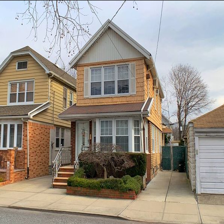
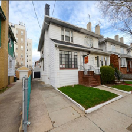
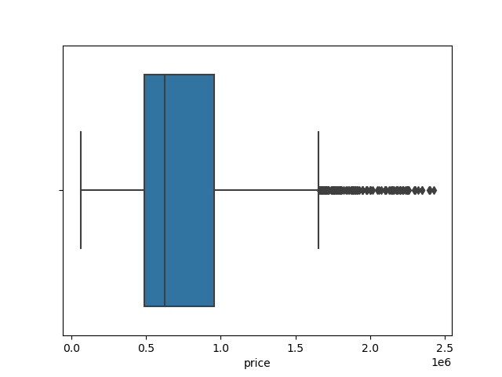
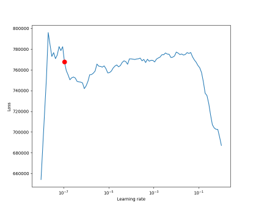
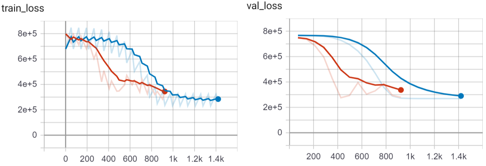

One of the most significant advantages of artificial deep neural networks has always been that they can pretty much take any kind of data as input and can approximate a non-linear function to predict on that data. I have been searching for online tutorials to create a neural network that takes tabular and image data as inputs and predicts a single value as output. So far, I have not found any start to end tutorials that implement such a network in PyTorch. Therefore I decided to tackle this question on my own. So in this tutorial, I will show you how you can use `PyTorch Lightning` to predict real estate prices of houses through matching image data and tabular information. [You can find the sample data sets used here](https://1drv.ms/u/s!AqUPqx8G81xZiL1l80RtZbjPj43MhA?e=KagzKc). The full working code is available through my [GitHub repository](https://github.com/MarkusRosen/pytorch_multi_input_example).

## Table of Contents

- [Table of Contents](#table-of-contents)
- [Installation and setup](#installation-and-setup)
- [New York Real Estate Data](#new-york-real-estate-data)
  - [Dataset](#dataset)
- [Multi-input deep neural network](#multi-input-deep-neural-network)
  - [Importing the libraries](#importing-the-libraries)
  - [Creating a custom PyTorch Dataset](#creating-a-custom-pytorch-dataset)
  - [Architecture](#architecture)
  - [Training](#training)
- [Running the model](#running-the-model)
- [Results](#results)
  - [Whats next?](#whats-next)

## Installation and setup

Deep learning and the respective libraries are changing fast; therefore, this tutorial might soon be partially out of date. At the time of this writing, all the code works with `Python 3.8` and `PyTorch 1.5` using Windows 10. The detailed requirements file to match all the versions you can find in the [GitHub repo](https://github.com/MarkusRosen/pytorch_multi_input_example/blob/master/requirements.txt). The requirements can be installed after creating a new environment, here a short example using `venv`:

```bash
python -m venv /path/to/new/virtual/env
cd /path/to/new/virtual/env/Scripts/
activate.bat
pip install -r /path/to/requirements.txt
```

Remember that PyTorch for Windows needs to be installed separately, you can find more information at the PyTorch website.

## New York Real Estate Data

Now, let us take a short look at our case study. In the data mentioned above, you will find one folder called `processed_images` containing 2,840 images of houses in New York. Each image is already resized to 224x224 pixels. You will also find a pickled `Pandas DataFrame` with tabular information about these houses.

### Dataset

In the table below, you can see a short excerpt of the data set. The first columns show the front of the house, followed by an id, price, latitude, longitude values, and the number of beds, baths as well as the total area of the house. Typically, there is quite a bit more information on homes available, but I want to keep it tidy for this tutorial. The id matches with the file name in the `processed_images` directory.

|                                                   | zpid     | price     | latitude  | longitude  | beds | baths | area   |
| ------------------------------------------------- | -------- | --------- | --------- | ---------- | ---- | ----- | ------ |
|  | 29777854 | 435000.0  | 40.826804 | -73.917024 | 3.0  | 2.0   | 1728.0 |
| ...                                               | ...      | ...       | ...       | ...        | ...  | ...   | ...    |
|  | 30742835 | 888000.0  | 40.603546 | -73.938332 | 3.0  | 3.0   | 1264.0 |
|  | 30742959 | 1160000.0 | 40.599407 | -73.959058 | 3.0  | 2.0   | 1564.0 |
|   | 5409160  | 257825.0  | 40.760407 | -73.796344 | 4.0  | 3.0   | 2100.0 |

Looking at the data, we can already see some differences in these examples. The first house looks a bit beat up, with a price tag of 435,000\$, while the second and third buildings look way nicer, but are two or three times more expensive. From this, we can already infer that humans can roughly guess the value of these homes only by looking at the pictures. Therefore, a deep convolutional neural network should be able to predict with a equally rough accuracy the price through the backpropagation algorithm.

|       | price        | latitude  | longitude  | beds     | baths    | area        |
| ----- | ------------ | --------- | ---------- | -------- | -------- | ----------- |
| count | 2840         | 2840      | 2840       | 2840     | 2840     | 2840        |
| mean  | 766,698.50   | 40.739368 | -73.912034 | 3.672183 | 2.519877 | 1796.098592 |
| std   | 391,802.30   | 0.115101  | 0.070550   | 1.119459 | 0.644396 | 565.281025  |
| min   | 60,000.00    | 40.573728 | -74.039917 | 1        | 1.500000 | 935         |
| 25%   | 486,625.20   | 40.624906 | -73.978018 | 3        | 2        | 1364        |
| 50%   | 625,000.00   | 40.685717 | -73.902310 | 3        | 2        | 1690        |
| 75%   | 955,000.00   | 40.851511 | -73.848839 | 4        | 3        | 2080        |
| max   | 2,430,000.00 | 40.911744 | -73.782983 | 7        | 4        | 3585        |

A look at the descriptive statistics gives a bit of insight into our tabular data, allowing us to adjust our expectations on the results of the upcoming predictions. We have 2,840 observations, which is not that much for our use case; typical deep learning data sets are larger by magnitudes. The small data set will most likely lead to inaccurate predictions when no transfer learning is used, which we should keep in mind later on. The data overall seems to be distributed okayish, so no outlier removal and further preprocessing are needed.



I like to inspect important features visually, to get a better understanding of their distributions. In the box plot above, we can see that the target feature `price` ranges from almost 0\$ to roughly 2.5 million \$. The standard deviation is 391,802.30\$.

## Multi-input deep neural network

After understanding our data, we can continue with the modeling through `PyTorch Lighting`. I chose `PyTorch Lighting` because regular `PyTorch` code can quickly get a bit... let's say _chaotic_. `PyTorch Lighting` is a light wrapper for `PyTorch`, which has some huge advantages: it forces a tidy structure and code. It also delivers a few super neat little helpers, which reduces the overall amount of time needed to write boilerplate code. In this tutorial, we will make use of the learning rate finder, early stopping, and experiment logging with `TensorBoard`. Another feature of `PyTorch Lighting` is that you can easily let your models run on multiple GPUs and TPUs if you have a machine learning server at your disposal.

On a first look, `PyTorch Lightning` CNNs can look a bit daunting, but once you have a complete example running, you can always go back to it as a template and save a lot of time in developing further CNNs.

### Importing the libraries

We start our code by importing all needed libraries and functions and setting our data path.

```python
import pandas as pd
import numpy as np
from PIL import Image

import torch
import torch.nn as nn
from torch.utils.data import Dataset, DataLoader, random_split
from torchvision import transforms

import pytorch_lightning as pl
from pytorch_lightning.logging import TensorBoardLogger
from pytorch_lightning.callbacks.early_stopping import EarlyStopping


data_path = "./data/"
```

### Creating a custom PyTorch Dataset

Since we want to combine tabular and image data, we need to construct our own `PyTorch Dataset`. This class inherits most of its features from `Dataset`, we only need to define three small functions: `__init__()`, `__len__()` and `__getitem__`.

```python
class ImageDataset(Dataset):
    """Tabular and Image dataset."""

    def __init__(self, pickle_file, image_dir):
        self.image_dir = image_dir
        self.pickle_file = pickle_file
        self.tabular = pd.read_pickle(pickle_file)

    def __len__(self):
        return len(self.tabular)

    def __getitem__(self, idx):
        if torch.is_tensor(idx):
            idx = idx.tolist()

        tabular = self.tabular.iloc[idx, 0:]

        y = tabular["price"]

        image = Image.open(f"{self.image_dir}/{tabular['zpid']}.png")
        image = np.array(image)
        image = image[..., :3]

        image = transforms.functional.to_tensor(image)

        tabular = tabular[["latitude", "longitude", "beds", "baths", "area"]]
        tabular = tabular.tolist()
        tabular = torch.FloatTensor(tabular)

        return image, tabular, y
```

Within the `__init__()`, we specify our variables we need and open the tabular data through pandas. The `__len__()` function only returns the total size of the data set, as defined by the size of the tabular data frame. In `__getitem__`, we select every row by the `idx`. Therefore we use the index locator of Pandas. We define our target feature `y` and open the correct image through the `zpid`. The .png-files contain four dimensions, `RGBA`, where the last parameter represents the pictures' alpha channel. Our network architecture will expect `RGB` values; therefore, we cut each image's last dimension. The image and tabular data are then transformed to torch tensors.

### Architecture

Now to get into the actual model. We need one convolutional neural network for our image data and a multi-layer perceptron for our tabular data. Both need to be combined and need to return a single prediction value. First, we define a single `conv_block`, a small custom CNN-layer that expects an input and output dimension. This will save us a bit of repetitive code writing later on.

```python
def conv_block(input_size, output_size):
    block = nn.Sequential(
        nn.Conv2d(input_size, output_size, (3, 3)), nn.ReLU(), nn.BatchNorm2d(output_size), nn.MaxPool2d((2, 2)),
    )

    return block
```

`PyTorch Lighting` works through the `pl.LightningModule`, all the following functions in this chapter will be part of this class. If you lose track of the whitespace, you can always look at the [full script in the GitHub repo](https://github.com/MarkusRosen/pytorch_multi_input_example/blob/master/pytorch_lightning_regression.py).

```python
class LitClassifier(pl.LightningModule):
    def __init__(
        self, lr: float = 1e-3, num_workers: int = 4, batch_size: int = 32,
    ):
        super().__init__()
        self.lr = lr
        self.num_workers = num_workers
        self.batch_size = batch_size

        self.conv1 = conv_block(3, 16)
        self.conv2 = conv_block(16, 32)
        self.conv3 = conv_block(32, 64)

        self.ln1 = nn.Linear(64 * 26 * 26, 16)
        self.relu = nn.ReLU()
        self.batchnorm = nn.BatchNorm1d(16)
        self.dropout = nn.Dropout2d(0.5)
        self.ln2 = nn.Linear(16, 5)

        self.ln4 = nn.Linear(5, 10)
        self.ln5 = nn.Linear(10, 10)
        self.ln6 = nn.Linear(10, 5)
        self.ln7 = nn.Linear(10, 1)
```

In our `__init__()` function, we define all the layers that we want to use in our network. I added a few standard parameters, the learning rate `lr`, the number of workers `num_workers`, and the `batch_size`. You can adjust the last two according to your hardware. We use three convolutional layers and two linear layers with some dropout and batch normalization for our image data. For our tabular data, we create a small multi-layer perceptron consisting of three linear layers. Keep in mind that the input and output sizes I chose here are according to my data set, which consists of 3-channel images and a table with 5 columns. If your data differs, you need to adjust all input and output values accordingly.

```python
    def forward(self, img, tab):
        img = self.conv1(img)
        img = self.conv2(img)
        img = self.conv3(img)
        img = img.reshape(img.shape[0], -1)
        img = self.ln1(img)
        img = self.relu(img)
        img = self.batchnorm(img)
        img = self.dropout(img)
        img = self.ln2(img)
        img = self.relu(img)

        tab = self.ln4(tab)
        tab = self.relu(tab)
        tab = self.ln5(tab)
        tab = self.relu(tab)
        tab = self.ln6(tab)
        tab = self.relu(tab)

        x = torch.cat((img, tab), dim=1)
        x = self.relu(x)

        return self.ln7(x)
```

The `forward()` function represents our architecture. The function accepts image and tabular data. The image data is used as input data in the first layers. Then, we run the tabular data through the multi-layer perceptron. The secret of multi-input neural networks in PyTorch comes after the last tabular line: `torch.cat()` combines the output data of the CNN with the output data of the MLP. The output of our CNN has a size of 5; the output of the MLP is also 5. Combining the two gives us a new input size of 10 for the last linear layer. Since we are doing regression in this tutorial, we do not need a softmax function in the end.

|     | Name      | Type        | Params |
| --- | --------- | ----------- | ------ |
| 0   | conv1     | Sequential  | 480    |
| 1   | conv2     | Sequential  | 4 K    |
| 2   | conv3     | Sequential  | 18 K   |
| 3   | ln1       | Linear      | 692 K  |
| 4   | relu      | ReLU        | 0      |
| 5   | batchnorm | BatchNorm1d | 32     |
| 6   | dropout   | Dropout2d   | 0      |
| 7   | ln2       | Linear      | 85     |
| 8   | ln4       | Linear      | 60     |
| 9   | ln5       | Linear      | 110    |
| 10  | ln6       | Linear      | 55     |
| 11  | ln7       | Linear      | 11     |

Our architecture now looks like the table above.

### Training

We need to define our training, validation, and test steps, which all look very similar. Each step-function gets a batch and batch_idx variable, from which we extract the images, tables, and target features for each batch. Our criterion is in this example, the mean absolute error (MAE), also known as L1-loss. The advantage of this error criterion is that it is in the same units as our target feature (\$) and, therefore, easy to interpret while training. We also want to monitor our outputs. Thus we return TensorBoard logs. Note that we do not need to specify our GPU as a target device or the actual training loop, as we would have to when using pure `PyTorch`.

```python
    def training_step(self, batch, batch_idx):
        image, tabular, y = batch

        criterion = torch.nn.L1Loss()
        y_pred = torch.flatten(self(image, tabular))
        y_pred = y_pred.double()

        loss = criterion(y_pred, y)

        tensorboard_logs = {"train_loss": loss}
        return {"loss": loss, "log": tensorboard_logs}

    def validation_step(self, batch, batch_idx):
        image, tabular, y = batch

        criterion = torch.nn.L1Loss()
        y_pred = torch.flatten(self(image, tabular))
        y_pred = y_pred.double()

        val_loss = criterion(y_pred, y)

        return {"val_loss": val_loss}

    def validation_epoch_end(self, outputs):
        avg_loss = torch.stack([x["val_loss"] for x in outputs]).mean()
        tensorboard_logs = {"val_loss": avg_loss}
        return {"val_loss": avg_loss, "log": tensorboard_logs}

    def test_step(self, batch, batch_idx):
        image, tabular, y = batch

        criterion = torch.nn.L1Loss()
        y_pred = torch.flatten(self(image, tabular))
        y_pred = y_pred.double()

        test_loss = criterion(y_pred, y)

        return {"test_loss": test_loss}

    def test_epoch_end(self, outputs):
        avg_loss = torch.stack([x["test_loss"] for x in outputs]).mean()
        logs = {"test_loss": avg_loss}
        return {"test_loss": avg_loss, "log": logs, "progress_bar": logs}
```

We also define the ends of a validation and test epoch, where we average the losses of the respective epoch over all mini-batches. This will be useful later on when we want to use early stopping.

To load our data into our model, we have to do a short `setup()`. Here we load the dataset and specify our training, testing, and validation splits. Please note that this code will only work if _0.8\*your data size_ will return whole numbers.

```python
    def setup(self, stage):

        image_data = ImageDataset(pickle_file=f"{data_path}df.pkl", image_dir=f"{data_path}processed_images/")

        train_size = int(0.80 * len(image_data))
        val_size = int((len(image_data) - train_size) / 2)
        test_size = int((len(image_data) - train_size) / 2)

        self.train_set, self.val_set, self.test_set = random_split(image_data, (train_size, val_size, test_size))

    def configure_optimizers(self):
        return torch.optim.Adam(self.parameters(), lr=(self.lr))

    def train_dataloader(self):
        return DataLoader(self.train_set, batch_size=self.batch_size)

    def val_dataloader(self):
        return DataLoader(self.val_set, batch_size=self.batch_size)

    def test_dataloader(self):
        return DataLoader(self.test_set, batch_size=self.batch_size)
```

In our example, we use `Adam` as our optimizer with the learning rate specified outside the model. We also need to specify the data loaders, which should be self-explanatory.

## Running the model

The following code is not part of the LightningModule and is used to start training and testing our model.

```python
if __name__ == "__main__":
    logger = TensorBoardLogger("lightning_logs", name="multi_input")
    early_stop_callback = EarlyStopping(monitor="val_loss", min_delta=5000, patience=7, verbose=False, mode="min")
```

We start with a Tensorboardlogger, which saves all the logs into a folder called `lightning_logs`. Additionally, we want to take advantage of early stopping. Early stopping means that the model will stop training if the validation predictions do not improve enough after a certain amount of epochs (patience). We set our patients to 7 epochs, where the minimum improvement has to be 5000\$; if it does not improve by more within 7 epochs, the model stops training.

```python
    model = LitClassifier()
    trainer = pl.Trainer(gpus=1, logger=logger, early_stop_callback=early_stop_callback)
```

Now we can create the model and a trainer, where we specify the number of GPUs we want to use and our logger and early stopping.

One question which always is challenging to answer in deep learning is the choice of the learning rate parameter. Often people just take a wild guess and try a few different ones, but `PyTorch Lightning` can help us with a learning rate finder. Through cyclically varying the learning rate with a few model restarts, we can find a reasonable starting learning rate.

```python
    lr_finder = trainer.lr_find(model)
    fig = lr_finder.plot(suggest=True, show=True)
    new_lr = lr_finder.suggestion()
    model.hparams.lr = new_lr
```

We use the suggested learning rate and add it to our model hyperparameters.



In the image above, we can see that the optimal learning rate is at the curve's steepest gradient. There are multiple similar steep gradients in this example. Therefore it might make sense to try a few of them in an actual real use case. Our ideal learning here is `0.0964781961431852e-07`, which is quite small.

Now we can start the actual training of the model and run the best epoch for our test dataset.

```python
    trainer.fit(model)
    trainer.test(model)
```

To monitor our training, we can also start a TensorBoard with

```bash
tensorboard --logdir=lightning_logs
```

in our Terminal.

## Results

To make the overall results a bit more interesting, I also ran the same dataset without the tabular data for comparison. The model without the tabular data is seen as the red line in the graphs, the multi-input model is plotted in blue.



We see that both models learn quite fast and can reduce the error in the training and validation data. The image only model was stopped a few epochs before the multi-input models due to the early stopping. However, still we can see that the combination of both data sets does lead to overall more accurate predictions.

| model                          | training error | validation error | testing error |
| ------------------------------ | -------------- | ---------------- | ------------- |
| only images (red)              | 329,860        | 312,030          | 299,645.16    |
| images and tabular data (blue) | 231,590        | 269,190          | 243,335.46    |

Our testing error for the mixed input model is at 243,335\$, which is not that bad considering the small amount of data and the evenly small neural network architecture.

### Whats next?

This tutorial was only a small introduction to PyTorch Lightning and how to implement multi-input models consisting of image and tabular data for regression. The next step should be to take advantage of transfer learning by using a pretrained network, retraining only the last layer. Transfer learning would probably improve the prediction quite a bit. The tabular data could also be further improved with feature engineering for the latitude and longitude values and categorical
