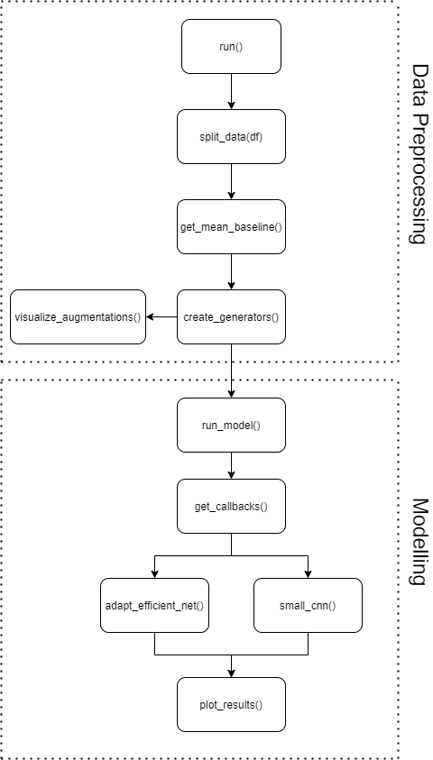
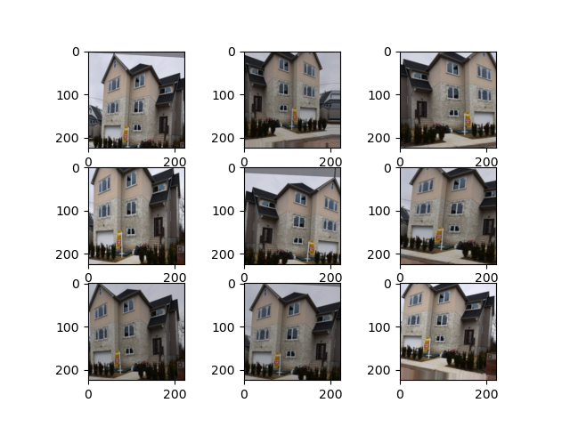
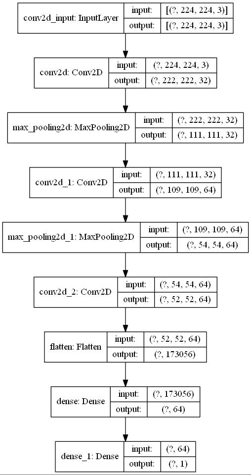
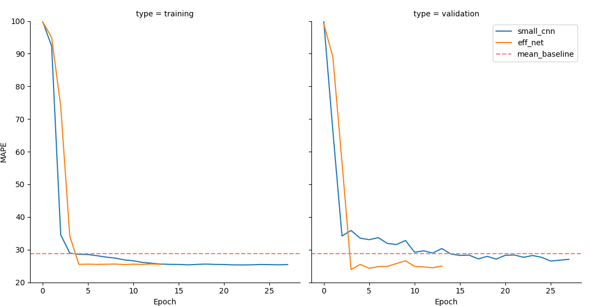

<script src="https://polyfill.io/v3/polyfill.min.js?features=es6"></script>

<script
      type="text/javascript"
      id="MathJax-script"
      async
      src="https://cdn.jsdelivr.net/npm/mathjax@3/es5/tex-chtml.js">
</script>

There are hundreds of tutorials online available on how to use Keras for deep learning. But at least to my impression, 99% of them just use the MNIST dataset and some form of a small custom convolutional neural network or ResNet for classification. Personally, I dislike the general idea of always using the easiest dataset for machine learning and deep learning tutorials since this leaves many important questions unanswered. Adapting these tutorials to a custom dataset for a regression problem can be a daunting and time-consuming task with hours of Googling and reading old StackOverflow questions or the official Keras documentation. Through this tutorial, I want to show you how to use a custom dataset and use transfer learning to get great results with very little training time. The following topics will be part of this tutorial:

- use ImageDataGenerators and Pandas DataFrames to load your custom dataset
- augment your image to improve prediction results
- plot augmentations
- adapt the state-of-the-art EfficientNet to a regression
- use the new Ranger optimizer from `tensorflow_addons`
- compare the EfficientNet results to a simpler custom convolutional neural network
- use the final model to inference on new data

For this, I have uploaded [a custom image dataset of housing prices](https://1drv.ms/u/s!AqUPqx8G81xZiawi20d2PucCFrAKzA?e=2MHhua) in New York with a corresponding DataFrame constisting of a handful of columns with additional information about the houses. The dataset consists of 10,900 images that I have already resized to 224x224 pixels. The full code of this tutorial can be found in the [GitHub Repository](https://github.com/MarkusRosen/keras-efficientnet-regression).

## Table of Contents

- [Table of Contents](#table-of-contents)
- [Preliminary Steps](#preliminary-steps)
  - [Code overview](#code-overview)
  - [Real Estate Data](#real-estate-data)
  - [Installation and Setup](#installation-and-setup)
  - [(Small Update using Conda instead of pip)](#small-update-using-conda-instead-of-pip)
- [Data Preprocessing](#data-preprocessing)
  - [Splitting the data](#splitting-the-data)
  - [Create ImageDataGenerators](#create-imagedatagenerators)
    - [Visualize Keras Data Augmentations](#visualize-keras-data-augmentations)
- [Creating the Convolutional Neural Networks](#creating-the-convolutional-neural-networks)
  - [Fitting a Keras Image CNN](#fitting-a-keras-image-cnn)
  - [Callbacks for Logging, Early Stopping, and Saving](#callbacks-for-logging-early-stopping-and-saving)
  - [Create a small custom CNN](#create-a-small-custom-cnn)
  - [Adapt EfficientNetB0 to our Custom Regression Problem](#adapt-efficientnetb0-to-our-custom-regression-problem)
- [Results](#results)
- [Inference on new data](#inference-on-new-data)

## Preliminary Steps

This tutorial requires a few steps of preparation before we can begin coding. I wrote this code with Windows 10 in mind. If you use Linux or macOS, you might have to adapt a few lines regarding the terminal commands.

### Code overview

Since we will write quite a few functions and around 430 lines of Python code, I have prepared a small flowchart to get a first impression of how the code should be structured later.



We will spend quite a bit of time on data preprocessing before implementing the EfficientNetB0 model's transfer learning. The visualization steps are optional but help understand the input data and the results in the end. If you are unsure about any stage in the tutorial, you can always look at the final code in the [GitHub Repository](https://github.com/MarkusRosen/keras-efficientnet-regression/blob/master/efficient_net_keras_regression.py).

### Real Estate Data

If you have read my [previous tutorial on multi-input PyTorch models](https://rosenfelder.ai/multi-input-neural-network-pytorch/), you might be familiar with the dataset already. It's basically the same dataset, but with more observations. In total, we will be using 10,900 images this time.

|                                                   | zpid     | price     | latitude  | longitude  | beds | baths | area   |
| ------------------------------------------------- | -------- | --------- | --------- | ---------- | ---- | ----- | ------ |
|  | 29777854 | 435000.0  | 40.826804 | -73.917024 | 3.0  | 2.0   | 1728.0 |
| ...                                               | ...      | ...       | ...       | ...        | ...  | ...   | ...    |
|  | 30742835 | 888000.0  | 40.603546 | -73.938332 | 3.0  | 3.0   | 1264.0 |
|  | 30742959 | 1160000.0 | 40.599407 | -73.959058 | 3.0  | 2.0   | 1564.0 |
|   | 5409160  | 257825.0  | 40.760407 | -73.796344 | 4.0  | 3.0   | 2100.0 |

As you can see, the dataset consists of images with a specific `zpid` and a `price` and a handful of other tabular features. We won't use the tabular features in this tutorial, except for the `price`. Each image is already at the target size of 224x224 pixels with 3 RGB color channels. If you are interested in how I prepared the tutorial data, you can take a look into [preprocess_dataframe.py](https://github.com/MarkusRosen/keras-efficientnet-regression/blob/master/preprocess_dataframe.py).

### Installation and Setup

Before we start the coding process, we need to create a new virtual environment. Adjust the following steps if you are using another package manager, like Anaconda. I used Python 3.8.2 for the tutorial, but other versions will likely work without any modifications. I use TensorFlow 2.3.0 and Keras 2.4.3. More details on the library version can be found in the [requirements.txt](https://github.com/MarkusRosen/keras-efficientnet-regression/blob/master/requirements.txt).

### (Small Update using Conda instead of pip)

If you prefer a conda setup, I wrote a short blog post about how to [setup Keras with GPU support on Linux](https://rosenfelder.ai/setup-keras-and-tensorflow/) using Miniconda. The resulting YAML for this project can be found here.

Enter the following lines into your command line:

```bash
python -m venv /path/to/new/virtual/env
cd /path/to/new/virtual/env/Scripts/
activate.bat
pip install -r /path/to/requirements.txt
```

[Download the dataset](https://1drv.ms/u/s!AqUPqx8G81xZiawi20d2PucCFrAKzA?e=2MHhua) and unzip it into your working directory. The data should now be found in `./data/`. Since we are already in the terminal, we can also download the newest `EfficientNetB0` weights with the `Noisy_Student` augmentations. To convert the weights for Keras transfer learning applications, we can use the official script from the Keras documentation. You can also find a [copy in my repository](https://github.com/MarkusRosen/keras-efficientnet-regression/blob/master/efficientnet_weight_update_util.py).

```bash
wget https://storage.googleapis.com/cloud-tpu-checkpoints/efficientnet/noisystudent/noisy_student_efficientnet-b0.tar.gz

tar -xf noisy_student_efficientnet-b0.tar.gz

python efficientnet_weight_update_util.py --model b0 --notop --ckpt noisy_student_efficientnet-b0/model.ckpt --o efficientnetb0_notop.h5
```

We can now import all libraries and functions that we will use for the rest of the tutorial.

```python
from typing import Iterator, List, Union, Tuple
from datetime import datetime
import pandas as pd
import matplotlib.pyplot as plt
import seaborn as sns
from sklearn.model_selection import train_test_split

from tensorflow import keras
from tensorflow.keras.preprocessing.image import ImageDataGenerator
from tensorflow.keras import layers, models, Model
from tensorflow.python.keras.callbacks import TensorBoard, EarlyStopping, ModelCheckpoint
from tensorflow.keras.losses import MeanAbsoluteError, MeanAbsolutePercentageError
from tensorflow.keras.models import Sequential
from tensorflow.keras.applications import EfficientNetB0
from tensorflow.keras.utils import plot_model
from tensorflow.keras.callbacks import History

import tensorflow_addons as tfa
```

## Data Preprocessing

Let's start with a few minor preprocessing steps. We load the Pandas DataFrame `df.pkl` through `pd.read_pickle()` and add a new column `image_location` with the location of our images. Each image has the `zpid` as a filename and a `.png` extension.

If you just want to check that your code is actually working, you can set `small_sample` to `True` in the `if __name__ == "__main__":` part. This will select the first 1,000 observations and reduce the computation time quite a bit.

```python
def run(small_sample=False):
    """Run all the code of this file.

    Parameters
    ----------
    small_sample : bool, optional
        If you just want to check if the code is working, set small_sample to True, by default False
    """

    df = pd.read_pickle("./data/df.pkl")
    df["image_location"] = (
        "./data/processed_images/" + df["zpid"] + ".png"
    )  # add the correct path for the image locations.
    if small_sample == True:
        df = df.iloc[0:1000]  # set small_sampe to True if you want to check if your code works without long waiting

if __name__ == "__main__":
    run(small_sample=False)
```

### Splitting the data

Our data needs to be split into training, validation, and test datasets. Additionally, we want to compute a naive baseline, where we assume that our training mean is our prediction value. The basic idea behind this is that anyone could just take the training data's mean to predict new data and might already get good results without any machine learning knowledge. With this, we can later better understand how useful our actual CNN predictions are compared to the naive baseline. The following two lines of code need to be added to our run function from before.

```python
def run():
    ...
    train, val, test = split_data(df)  # split your data
    mean_baseline = get_mean_baseline(train, val)

```

We can now add the `split_data()` function to split the data two times, once for a training set and validation set, and afterward to a test set. The resulting ratio is 70/20/10 for training/validation/test.

```python
def split_data(df: pd.DataFrame) -> Tuple[pd.DataFrame, pd.DataFrame, pd.DataFrame]:
    """Accepts a Pandas DataFrame and splits it into training, testing and validation data. Returns DataFrames.

    Parameters
    ----------
    df : pd.DataFrame
        Your Pandas DataFrame containing all your data.

    Returns
    -------
    Union[pd.DataFrame, pd.DataFrame, pd.DataFrame]
        [description]
    """
    train, val = train_test_split(df, test_size=0.2, random_state=1)  # split the data with a validation size o 20%
    train, test = train_test_split(
        train, test_size=0.125, random_state=1
    )  # split the data with an overall  test size of 10%

    print("shape train: ", train.shape)  # type: ignore
    print("shape val: ", val.shape)  # type: ignore
    print("shape test: ", test.shape)  # type: ignore

    print("Descriptive statistics of train:")
    print(train.describe())  # type: ignore
    return train, val, test  # type: ignore
```

```bash
shape train:  (7630, 8)
shape val:  (2180, 8)
shape test:  (1090, 8)
```

We can also better understand our data by taking a look into our training DataFrame with `df.describe()`. The only column of interest for this tutorial is `price`, ranging from 247,250\$ to 1,880,000\$ with an average of 707,119\$ and a standard deviation of 254,813\$.

|       | price        | latitude    | longitude   | beds        | baths      | area        |
| ----- | ------------ | ----------- | ----------- | ----------- | ---------- | ----------- |
| count | 7.630000e+03 | 7630.000000 | 7630.000000 | 7630.000000 | 7630.00000 | 7630.000000 |
| mean  | 7.071194e+05 | 40.652833   | -73.967080  | 3.529489    | 2.58884    | 1785.572215 |
| std   | 2.548134e+05 | 0.087778    | 0.159395    | 0.802316    | 0.69349    | 625.659971  |
| min   | 2.472500e+05 | 40.498819   | -74.253899  | 3.000000    | 1.25000    | 898.000000  |
| 25%   | 5.350000e+05 | 40.590321   | -74.128069  | 3.000000    | 2.00000    | 1323.250000 |
| 50%   | 6.400000e+05 | 40.629784   | -73.938199  | 3.000000    | 2.00000    | 1616.000000 |
| 75%   | 8.350000e+05 | 40.713520   | -73.819999  | 4.000000    | 3.00000    | 2068.000000 |
| max   | 1.880000e+06 | 40.911744   | -73.702905  | 6.000000    | 4.50000    | 4394.000000 |

To make interpretations of our results more straightforward, we will use the mean absolute percentage error (MAPE). The MAPE is defined as

$$MAPE = \frac{1}{n}\sum_{i=1}^{n} \|\frac{y_i - \hat{y_i}}{y_i}\|*100$$.

Therefore, each loss from now on will be represented by a percentage of the error. If our actual value is 100\$ and our model predicts 110\$, we will get a 10% MAPE.

```python
def get_mean_baseline(train: pd.DataFrame, val: pd.DataFrame) -> float:
    """Calculates the mean MAE and MAPE baselines by taking the mean values of the training data as prediction for the
    validation target feature.

    Parameters
    ----------
    train : pd.DataFrame
        Pandas DataFrame containing your training data.
    val : pd.DataFrame
        Pandas DataFrame containing your validation data.

    Returns
    -------
    float
        MAPE value.
    """
    y_hat = train["price"].mean()
    val["y_hat"] = y_hat
    mae = MeanAbsoluteError()
    mae = mae(val["price"], val["y_hat"]).numpy()  # type: ignore
    mape = MeanAbsolutePercentageError()
    mape = mape(val["price"], val["y_hat"]).numpy()  # type: ignore

    print(mae)
    print("mean baseline MAPE: ", mape)

    return mape
```

Results in:

```bash
mean baseline MAPE:  28.71662139892578
```

Our mean baseline MAPE is 28.72%. This is the naive benchmark that we try to beat in the next few sections of the tutorial.

### Create ImageDataGenerators

After finishing the preliminary steps, we can get to the interesting part of implementing a custom dataset into Keras. Let's start by adding the following line to our `run()` function:

```python
def run():
    ...
    train_generator, validation_generator, test_generator = create_generators(
        df=df, train=train, val=val, test=test, visualize_augmentations=True
    )
```

We now need to write a function `create_generators()` that takes our input data and creates three Keras `ImageDataGenerators`, one for each split of the data. There are two steps involved in creating `ImageDataGenerators`: first, create an instance of the `ImageDataGenerator` class and then let the data flow into it, in our case, through a Pandas DataFrame.

In the first step, we add a few standard data augmentations to our training generator. Augmentations help our CNN training a lot if we have only a small dataset. They generate new observations of the same image with a few minor edits, which a human could clearly identify as the same image. In this case, they are relatively conservative since it would not really make sense to vertically flip a picture of a house. We don't add any augmentations in our validation and training data, as we would expect new unseen data to also be in a non-augmentated format.

To feed data into the generator, we use `flow_from_dataframe()` for each generator separately. We specify which DataFrame we want to use, which column contains our image data `x_col`, what our desired image size and batch size should be. Later on, we will use `EfficientNetB0`, which expects an input size of 224x224. If you use any other EfficientNet architecture, you need to change the input image size accordingly. Please either decrease or increase the `batch_size` according to your GPU. For regressions, we use the `class_mode` of `raw`.

We visualize the augmentations with another function later to get an impression of how they change our input data.

```python
def create_generators(
    df: pd.DataFrame, train: pd.DataFrame, val: pd.DataFrame, test: pd.DataFrame, visualize_augmentations: Any
) -> Tuple[Iterator, Iterator, Iterator]:
    """Accepts four Pandas DataFrames: all your data, the training, validation and test DataFrames. Creates and returns
    keras ImageDataGenerators. Within this function you can also visualize the augmentations of the ImageDataGenerators.

    Parameters
    ----------
    df : pd.DataFrame
        Your Pandas DataFrame containing all your data.
    train : pd.DataFrame
        Your Pandas DataFrame containing your training data.
    val : pd.DataFrame
        Your Pandas DataFrame containing your validation data.
    test : pd.DataFrame
        Your Pandas DataFrame containing your testing data.

    Returns
    -------
    Tuple[Iterator, Iterator, Iterator]
        keras ImageDataGenerators used for training, validating and testing of your models.
    """
    train_generator = ImageDataGenerator(
        rescale=1.0 / 255,
        rotation_range=5,
        width_shift_range=0.1,
        height_shift_range=0.1,
        brightness_range=(0.75, 1),
        shear_range=0.1,
        zoom_range=[0.75, 1],
        horizontal_flip=True,
        validation_split=0.2,
    )  # create an ImageDataGenerator with multiple image augmentations
    validation_generator = ImageDataGenerator(
        rescale=1.0 / 255
    )  # except for rescaling, no augmentations are needed for validation and testing generators
    test_generator = ImageDataGenerator(rescale=1.0 / 255)
    # visualize image augmentations
    if visualize_augmentations == True:
        visualize_augmentations(train_generator, df)

    train_generator = train_generator.flow_from_dataframe(
        dataframe=train,
        x_col="image_location",  # this is where your image data is stored
        y_col="price",  # this is your target feature
        class_mode="raw",  # use "raw" for regressions
        target_size=(224, 224),
        batch_size=128, # increase or decrease to fit your GPU
    )

    validation_generator = validation_generator.flow_from_dataframe(
        dataframe=val,
        x_col="image_location",
        y_col="price",
        class_mode="raw",
        target_size=(224, 224),
        batch_size=128,
    )
    test_generator = test_generator.flow_from_dataframe(
        dataframe=test,
        x_col="image_location",
        y_col="price",
        class_mode="raw",
        target_size=(224, 224),
        batch_size=128,
    )
    return train_generator, validation_generator, test_generator
```

#### Visualize Keras Data Augmentations

We should look into our data augmentations to make sure that they make sense in a real-world application. Therefore we need to write the `visualize_augmentations()` function that we used in our `create_generators()` function above. I pretty much hacked this together to only sample the same image 9 times out of the custom generator by giving the `flow_from_dataframe()` function a small DataFrame with only two identical observations. There is probably a better way to do this, but it does the job well enough.

We create a 3x3 grid of `matplotlib` plots and sample one image each time from our small generator. Each will have a few augmentations added randomly.

```python
def visualize_augmentations(data_generator: ImageDataGenerator, df: pd.DataFrame):
    """Visualizes the keras augmentations with matplotlib in 3x3 grid. This function is part of create_generators() and
    can be accessed from there.

    Parameters
    ----------
    data_generator : Iterator
        The keras data generator of your training data.
    df : pd.DataFrame
        The Pandas DataFrame containing your training data.
    """
    # super hacky way of creating a small dataframe with one image
    series = df.iloc[2]

    df_augmentation_visualization = pd.concat([series, series], axis=1).transpose()

    iterator_visualizations = data_generator.flow_from_dataframe(  # type: ignore
        dataframe=df_augmentation_visualization,
        x_col="image_location",
        y_col="price",
        class_mode="raw",
        target_size=(224, 224),  # size of the image
        batch_size=1,  # use only one image for visualization
    )

    for i in range(9):
        ax = plt.subplot(3, 3, i + 1)  # create a 3x3 grid
        batch = next(iterator_visualizations)  # get the next image of the generator (always the same image)
        img = batch[0]  # type: ignore
        img = img[0, :, :, :]  # remove one dimension for plotting without issues
        plt.imshow(img)
    plt.show()
    plt.close()
```



The resulting plot shows us the same building, sometimes a bit rotated, mirrored, or zoomed in with minor brightness adjustments. Nevertheless, each image is clearly recognizable as the same house and should improve our CNN models, which was our goal in adding the augmentations.

## Creating the Convolutional Neural Networks

In this tutorial, we want to compare a pre-trained EfficientNet with a simple custom CNN. To avoid writing too much duplicate code, we first write a general fitting function, where we can use any CNN we'd like. This makes sure that we have the same overall setup for our model comparisons later. We also need to write a few callbacks that we add to our models. After that, each model gets its own function with a few custom lines of code.

### Fitting a Keras Image CNN

We start with the general fitting function `run_model()`. The function gets a model name as a string, a model function, which we will write soon, a learning rate, and all of our data.

```python

def run_model(
    model_name: str,
    model_function: Model,
    lr: float,
    train_generator: Iterator,
    validation_generator: Iterator,
    test_generator: Iterator,
) -> History:
    """This function runs a keras model with the Ranger optimizer and multiple callbacks. The model is evaluated within
    training through the validation generator and afterwards one final time on the test generator.

    Parameters
    ----------
    model_name : str
        The name of the model as a string.
    model_function : Model
        Keras model function like small_cnn()  or adapt_efficient_net().
    lr : float
        Learning rate.
    train_generator : Iterator
        keras ImageDataGenerators for the training data.
    validation_generator : Iterator
        keras ImageDataGenerators for the validation data.
    test_generator : Iterator
        keras ImageDataGenerators for the test data.

    Returns
    -------
    History
        The history of the keras model as a History object. To access it as a Dict, use history.history. For an example
        see plot_results().
    """

    callbacks = get_callbacks(model_name)
    model = model_function
    model.summary()
    plot_model(model, to_file=model_name + ".jpg", show_shapes=True)

    radam = tfa.optimizers.RectifiedAdam(learning_rate=lr)
    ranger = tfa.optimizers.Lookahead(radam, sync_period=6, slow_step_size=0.5)
    optimizer = ranger

    model.compile(
        optimizer=optimizer, loss="mean_absolute_error", metrics=[MeanAbsoluteError(), MeanAbsolutePercentageError()]
    )
    history = model.fit(
        train_generator,
        epochs=100,
        validation_data=validation_generator,
        callbacks=callbacks,
        workers=6, # adjust this according to the number of CPU cores of your machine
    )

    model.evaluate(
        test_generator,
        callbacks=callbacks,
    )
    return history  # type: ignore
```

The first step in our fitting method is to get the callbacks. The `callbacks()` function is explained below. We then get our model through the custom `model_function`, print a summary, and plot the model to a file. As optimizers, I chose Ranger, which combines Rectified Adam with Lookahead, as this is pretty much state-of-the-art in CNN optimizers and should generate results as accurate as SGD but as fast as Adam. You can read more about them in the according papers ([Lookahead](https://arxiv.org/abs/1907.08610v1), [Rectified Adam](https://arxiv.org/abs/1908.03265), [Ranger](https://medium.com/@lessw/new-deep-learning-optimizer-ranger-synergistic-combination-of-radam-lookahead-for-the-best-of-2dc83f79a48d)).

We compile our model, use the mean absolute error (MAE) as the loss function, and print the MAPE for each epoch in our metrics. Our model can now be trained with `fit()`, where we specify the training generator, validation generator, callbacks, and workers.

To see how our model performs on unseen data, we evaluate the `test_generator`.

### Callbacks for Logging, Early Stopping, and Saving

Since our training might take a while, we might want to monitor the training steps with `TensorBoard`. For this, we create a new directory for each model with the current time and date and then start Tensorboard.

To open TensorBoard, you need to enter `tensorboard --logdir logs/scalars` in your terminal/command line and then open the standard page in your browser, most likely [http://localhost:6006/](http://localhost:6006/). Early Stopping will help us decrease overall training time by stopping the training after the model does not improve for a specified amount of epochs (`patience`) with a minimum improvement of `min_delta`. In our case, we want our model to improve by at least 1%. If it can't achieve this for 10 epochs straight, the training will end automatically. We also want to return the best epoch; therefore, we set `restore_best_weights=True`.

```python
def get_callbacks(model_name: str) -> List[Union[TensorBoard, EarlyStopping, ModelCheckpoint]]:
    """Accepts the model name as a string and returns multiple callbacks for training the keras model.

    Parameters
    ----------
    model_name : str
        The name of the model as a string.

    Returns
    -------
    List[Union[TensorBoard, EarlyStopping, ModelCheckpoint]]
        A list of multiple keras callbacks.
    """
    logdir = (
        "logs/scalars/" + model_name + "_" + datetime.now().strftime("%Y%m%d-%H%M%S")
    )  # create a folder for each model.
    tensorboard_callback = TensorBoard(log_dir=logdir)
    # use tensorboard --logdir logs/scalars in your command line to startup tensorboard with the correct logs

    early_stopping_callback = EarlyStopping(
        monitor="val_mean_absolute_percentage_error",
        min_delta=1,  # model should improve by at least 1%
        patience=10,  # amount of epochs  with improvements worse than 1% until the model stops
        verbose=2,
        mode="min",
        restore_best_weights=True,  # restore the best model with the lowest validation error
    )

    model_checkpoint_callback = ModelCheckpoint(
        "./data/models/" + model_name + ".h5",
        monitor="val_mean_absolute_percentage_error",
        verbose=0,
        save_best_only=True,  # save the best model
        mode="min",
        save_freq="epoch",  # save every epoch
    )  # saving eff_net takes quite a bit of time
    return [tensorboard_callback, early_stopping_callback, model_checkpoint_callback]
```

We also want to save our model after each epoch. For this we use `ModelCheckpoint()`. For `EfficientNetB0` this takes quite a while, so you might want to disable saving by removing `model_checkpoint_callback` from the returned values list.

### Create a small custom CNN

A small custom CNN will help us understand how well transfer learning with EfficientNet actually performs through direct comparison. We add the following code to our `run()` function:

```python
def run():
    ...
    small_cnn_history = run_model(
        model_name="small_cnn",
        model_function=small_cnn(),
        lr=0.001,
        train_generator=train_generator,
        validation_generator=validation_generator,
        test_generator=test_generator,
    )
```

And create the `small_cnn()` function with a few convolutional layers, max pooling, and two linear layers in the end. Our `input_shape` corresponds to our image data size of 224x224 pixels with 3 RGB dimensions for color.

```python
def small_cnn() -> Sequential:
    """A very small custom convolutional neural network with image input dimensions of 224x224x3.

    Returns
    -------
    Sequential
        The keras Sequential model.
    """
    model = models.Sequential()
    model.add(layers.Conv2D(32, (3, 3), activation="relu", input_shape=(224, 224, 3)))
    model.add(layers.MaxPooling2D((2, 2)))
    model.add(layers.Conv2D(64, (3, 3), activation="relu"))
    model.add(layers.MaxPooling2D((2, 2)))
    model.add(layers.Conv2D(64, (3, 3), activation="relu"))

    model.add(layers.Flatten())
    model.add(layers.Dense(64, activation="relu"))
    model.add(layers.Dense(1))

    return model
```



This small custom model looks like the image above and is still relatively easy to understand. The model should run each epoch a bit fast than the larger `EfficientNetB0` model we implement in the next step.

### Adapt EfficientNetB0 to our Custom Regression Problem

We can now continue and adapt `EfficientNetB0` to our data. We add the following lines to our `run()` function:

```python
def run():
    ...
    eff_net_history = run_model(
        model_name="eff_net",
        model_function=adapt_efficient_net(),
        lr=0.5,
        train_generator=train_generator,
        validation_generator=validation_generator,
        test_generator=test_generator,
    )
```

And can now create the `adapt_efficient_net` function. This is very similar to the [official Keras tutorial](https://keras.io/examples/vision/image_classification_efficientnet_fine_tuning/) but uses the updated NoisyStudent weights we prepared at the beginning of this tutorial. We also change the final layer of the model to regression rather than a classification. To achieve this, we use a Dense layer with 1 output and no activation function.

```python
def adapt_efficient_net() -> Model:
    """This code uses adapts the most up-to-date version of EfficientNet with NoisyStudent weights to a regression
    problem. Most of this code is adapted from the official keras documentation.

    Returns
    -------
    Model
        The keras model.
    """
    inputs = layers.Input(
        shape=(224, 224, 3)
    )  # input shapes of the images should always be 224x224x3 with EfficientNetB0
    # use the downloaded and converted newest EfficientNet wheights
    model = EfficientNetB0(include_top=False, input_tensor=inputs, weights="efficientnetb0_notop.h5")
    # Freeze the pretrained weights
    model.trainable = False

    # Rebuild top
    x = layers.GlobalAveragePooling2D(name="avg_pool")(model.output)
    x = layers.BatchNormalization()(x)
    top_dropout_rate = 0.4
    x = layers.Dropout(top_dropout_rate, name="top_dropout")(x)
    outputs = layers.Dense(1, name="pred")(x)

    # Compile
    model = keras.Model(inputs, outputs, name="EfficientNet")

    return model
```

These few lines suffice to implement transfer learning for EfficientNet with Keras. On my personal Laptop with a GeForce RTX 2070 mobile, each epoch takes around 1 minute to train. `EfficientNetB0` is quite large, [the actual model looks like this](../assets/img/post4/eff_net.jpg).

## Results

Let's plot our training results so that we can compare the accuracy of our predictions for each model for the training and validation data:

```python
def run():
    ...
    plot_results(small_cnn_history, eff_net_history, mean_baseline)

```

For the plots, we use each model's history data and create a small `sns.relplot()` with a few custom labels.

```python
def plot_results(model_history_small_cnn: History, model_history_eff_net: History, mean_baseline: float):
    """This function uses seaborn with matplotlib to plot the trainig and validation losses of both input models in an
    sns.relplot(). The mean baseline is plotted as a horizontal red dotted line.

    Parameters
    ----------
    model_history_small_cnn : History
        keras History object of the model.fit() method.
    model_history_eff_net : History
        keras History object of the model.fit() method.
    mean_baseline : float
        Result of the get_mean_baseline() function.
    """

    # create a dictionary for each model history and loss type
    dict1 = {
        "MAPE": model_history_small_cnn.history["mean_absolute_percentage_error"],
        "type": "training",
        "model": "small_cnn",
    }
    dict2 = {
        "MAPE": model_history_small_cnn.history["val_mean_absolute_percentage_error"],
        "type": "validation",
        "model": "small_cnn",
    }
    dict3 = {
        "MAPE": model_history_eff_net.history["mean_absolute_percentage_error"],
        "type": "training",
        "model": "eff_net",
    }
    dict4 = {
        "MAPE": model_history_eff_net.history["val_mean_absolute_percentage_error"],
        "type": "validation",
        "model": "eff_net",
    }

    # convert the dicts to pd.Series and concat them to a pd.DataFrame in the long format
    s1 = pd.DataFrame(dict1)
    s2 = pd.DataFrame(dict2)
    s3 = pd.DataFrame(dict3)
    s4 = pd.DataFrame(dict4)
    df = pd.concat([s1, s2, s3, s4], axis=0).reset_index()
    grid = sns.relplot(data=df, x=df["index"], y="MAPE", hue="model", col="type", kind="line", legend=False)
    grid.set(ylim=(20, 100))  # set the y-axis limit
    for ax in grid.axes.flat:
        ax.axhline(
            y=mean_baseline, color="lightcoral", linestyle="dashed"
        )  # add a mean baseline horizontal bar to each plot
        ax.set(xlabel="Epoch")
    labels = ["small_cnn", "eff_net", "mean_baseline"]  # custom labels for the plot

    plt.legend(labels=labels)
    plt.savefig("training_validation.png")
    plt.show()
```


The results are shown above. The red dotted line represents our mean baseline, the blue line our small custom CNN and the orange line our adapted `EfficientNetB0`. Quite interestingly, `EfficientNetB0` reaches it's lowest validation error already in the 4th epoch, while our custom model needs 18 Epochs to get to it's minimum. On my machine, the custom CNN required 17m30s to reach it's lowest value, while EfficientNet needed only 3m40s to reach an even lower error. In my run of both models, EfficientNetB0 reached an error of 23.9706%, the custom model an error of 27.8397%, which is barely below our baseline of 28.7166%. This shows us that transfer learning can help decrease training time while increasing prediction accuracy on custom data for regressions!

## Inference on new data

Now that we have a model trained and saved, one might want to use this model on new, unseen data for inferencing. In our example we saved the weights only, not the model, therefore we need to re-establish our model before loading our trained weights. For this, we create a new file ìnference.py` in our projects root folder. In the following code I assume that your new and unseen data is located in a separate folder, with no other data needed. If your data is linked to a .csv-file you have to change the code accordingly.

```python
from tensorflow.keras import layers, models, Model
from tensorflow.keras.applications import EfficientNetB0
from tensorflow import keras
import os
from PIL import Image
import numpy as np

# the next 3 lines of code are for my machine and setup due to https://github.com/tensorflow/tensorflow/issues/43174
import tensorflow as tf

physical_devices = tf.config.list_physical_devices("GPU")
tf.config.experimental.set_memory_growth(physical_devices[0], True)


def adapt_efficient_net() -> Model:
    """This code uses adapts the most up-to-date version of EfficientNet with NoisyStudent weights to a regression
    problem. Most of this code is adapted from the official keras documentation.

    Returns
    -------
    Model
        The keras model.
    """
    inputs = layers.Input(
        shape=(224, 224, 3)
    )  # input shapes of the images should always be 224x224x3 with EfficientNetB0
    # use the downloaded and converted newest EfficientNet wheights
    model = EfficientNetB0(include_top=False, input_tensor=inputs, weights="efficientnetb0_notop.h5")
    # Freeze the pretrained weights
    model.trainable = False

    # Rebuild top
    x = layers.GlobalAveragePooling2D(name="avg_pool")(model.output)
    x = layers.BatchNormalization()(x)
    top_dropout_rate = 0.4
    x = layers.Dropout(top_dropout_rate, name="top_dropout")(x)
    outputs = layers.Dense(1, name="pred")(x)

    # Compile
    model = keras.Model(inputs, outputs, name="EfficientNet")

    return model


def open_images(inference_folder: str) -> np.ndarray:
    """Loads images from a folder and prepare them for inferencing.

    Parameters
    ----------
    inference_folder : str
        Location of images for inferencing.

    Returns
    -------
    np.ndarray
        List of images as numpy arrays transformed to fit the efficient_net model input specs.
    """
    images = []
    for img in os.listdir(inference_folder):
        img_location = os.path.join(inference_folder, img)  # create full path to image

        with Image.open(img_location) as img:  # open image with pillow

            img = np.array(img)
            img = img[:, :, :3]
            img = np.expand_dims(img, axis=0)  # add 0 dimension to fit input shape of efficient_net

        images.append(img)
    images_array = np.vstack(images)  # combine images efficiently to a numpy array
    return images_array


model = adapt_efficient_net()
model.load_weights("./data/models/eff_net.h5")
images = open_images("./inference_samples")

predictions = model.predict(images)

images_names = os.listdir("./inference_samples")
for image_name, prediction in zip(images_names, predictions):
    print(image_name, prediction)
```

After recreating our model and loading the trained weights, we can inference on new data. We open the images found in our inferencing folder and apply a few numpy operations on them to make them fit into our model input specifications. Afterwards we can simply use `model.predict()` on our images and print the results.

As always, you can find the complete code of this tutorial in the according to [GitHub Repository](https://github.com/MarkusRosen/keras-efficientnet-regression).

If this tutorial was helpful for your research, you can cite it with

```bash
@misc{rosenfelderaikeras2020,
  author = {Rosenfelder, Markus},
  title = {Transfer Learning with EfficientNet for Image Regression in Keras - Using Custom Data in Keras},
  year = {2020},
  publisher = {rosenfelder.ai},
  journal = {rosenfelder.ai},
  howpublished = {\url{https://rosenfelder.ai/keras-regression-efficient-net/}},
}
```
