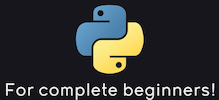
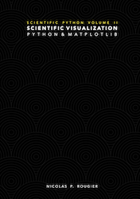
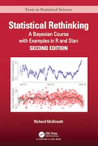
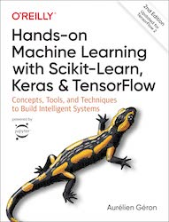

As I'm nearing the end of my time as a Ph.D. student, I was wondering how I would approach it differently if I had the chance to do so. I have bachelor's and master's degrees in Economics, so my knowledge in programming and data science was limited before entering a Ph.D. program in information systems with an intense focus on applied machine learning. Thus, I had to work intensely on brushing up my programming, machine learning, and deep learning skills in a short amount of time on my own.

The sheer amount of available books, courses, and tutorials on data science can be overwhelming. In this blog post, I collected all the material that, in my personal opinion, gives a great introduction to python programming, data preprocessing, machine learning as well as data engineering. If anyone has additional recommendations, please post them in the comments with a short explanation of why you found them helpful!

You might notice that I'm mentioning many things that are not directly related to training deep learning models. I spent most of my time as a Ph.D. student wrangling and merging large, complex data sets, visualizing non-linear relationships, engineering complex data processing pipelines, and delivering interactive results to project partners. I spent way less of my time actually training any models. Therefore, I put more emphasis on engineering and data processing in this post than you might expect.

## Table of Contents

- [Table of Contents](#table-of-contents)
- [General Introduction to CS and Programming](#general-introduction-to-cs-and-programming)
  - [Introduction to Python Programming](#introduction-to-python-programming)
    - [Automate the Boring Stuff](#automate-the-boring-stuff)
    - [Python for absolute beginners](#python-for-absolute-beginners)
  - [Linux, VSCode, Git, Docker and Containerization](#linux-vscode-git-docker-and-containerization)
    - [The Missing Semester of Your CS Education](#the-missing-semester-of-your-cs-education)
    - [Setting up VSCode for Data Science](#setting-up-vscode-for-data-science)
    - [Docker for Machine Learning](#docker-for-machine-learning)
  - [Databases](#databases)
- [Introduction to Machine Learning, Deep Learning and Explainable AI](#introduction-to-machine-learning-deep-learning-and-explainable-ai)
  - [Data Preprocessing in Python](#data-preprocessing-in-python)
  - [Data Visualization](#data-visualization)
    - [Fundamentals of Data Visualization](#fundamentals-of-data-visualization)
    - [Scientific Visualization - Python & Matplotlib](#scientific-visualization---python--matplotlib)
    - [Streamlit](#streamlit)
    - [quarto](#quarto)
  - [Statistics](#statistics)
    - [Statistical Rethinking: A Bayesian Course with Examples in R and STAN](#statistical-rethinking-a-bayesian-course-with-examples-in-r-and-stan)
  - [Machine Learning](#machine-learning)
    - [Hands-On Machine Learning with Scikit-Learn, Keras, and TensorFlow, 2nd Edition](#hands-on-machine-learning-with-scikit-learn-keras-and-tensorflow-2nd-edition)
    - [Applied Predictive Modelling](#applied-predictive-modelling)
  - [Deep Learning](#deep-learning)
    - [Deep Learning with Python](#deep-learning-with-python)
    - [Practical Deep Learning Course](#practical-deep-learning-course)
  - [Explainable AI](#explainable-ai)
    - [Interpretable Machine Learning - A Guide for Making Black Box Models Explainable](#interpretable-machine-learning---a-guide-for-making-black-box-models-explainable)
    - [Alibi Explain](#alibi-explain)
    - [Shapley](#shapley)
    - [InterpretML](#interpretml)
  - [Hyperparameter tuning](#hyperparameter-tuning)
    - [Optuna](#optuna)
- [Conclusion](#conclusion)

## General Introduction to CS and Programming

I'll start with a general introduction to applied computer science and programming. An excellent technical understanding of the underlying basics will pay 10x later when working with highly complex data, libraries, and concepts.

### Introduction to Python Programming

Python is still the #1 programming language for machine learning and data science in general. Other languages in this area are R and Julia, which are great for different reasons. Still, they do not come close to the vast amount of libraries and the overall large Python community online.

#### Automate the Boring Stuff

I personally learned Python programming a few years ago with a printed edition of [Automate the Boring Stuff with Python](https://automatetheboringstuff.com/). It is an excellent introduction to programming due to the shallow entry barrier and steady learning curve. Still, it does not shy away from more complex examples and gives beginners a chance to play around with python code on their own.

#### Python for absolute beginners

[Python for absolute Beginners](https://www.youtube.com/watch?v=mDKM-JtUhhc) is a great recommendation for people who learn better with a video course and a lecturer. It is a free 11-hour course covering the same programming principles as Automate the boring Stuff.

### Linux, VSCode, Git, Docker and Containerization

A basic understanding of Linux, Git, and Containerization with Docker and VSCode as an editor might seem too much for any new data science learners. Still, it is one of the most essential basics to get work done efficiently later in your career. In addition, code reproducibility and working in a team through Git/Github are invaluable skills.

#### The Missing Semester of Your CS Education

As you get more advanced in your data science career, you will inevitably get in touch with Linux as an operating system on some remote server or working station. [The Missing Semester of Your CS Education](https://missing.csail.mit.edu/) teaches the basics of working in a shell terminal, version control with Git, and code debugging.

#### Setting up VSCode for Data Science

I have used VSCode as my primary code editor for years and would always recommend it as the first and only choice for new data scientists. As with Python, the community around VSCode is vast, and everything you would ever need regarding programming is either already implemented in the editor or available as extensions. In addition, the ability to remotely program on workstations via SSH or even within docker containers has been insanely valuable and time-saving for me.

These three tutorials help you get started with Python, Data Science and remote development with VSCode:

- [Getting Started with Python in VS Code](https://code.visualstudio.com/docs/python/python-tutorial)
- [Data Science in VS Code tutorial](https://code.visualstudio.com/docs/datascience/data-science-tutorial)

- [VS Code Remote Development](https://code.visualstudio.com/docs/remote/remote-overview)

A few extensions I would always recommend:

- [autoDocstring](https://marketplace.visualstudio.com/items?itemName=njpwerner.autodocstring): automatically generates docstring templates for your Python functions.
- [Better Comments](https://marketplace.visualstudio.com/items?itemName=aaron-bond.better-comments): Highlights comments in specific colors through keywords.
- [Prettier](https://marketplace.visualstudio.com/items?itemName=esbenp.prettier-vscode): Automatic code formatting, combined with [Black](https://github.com/psf/black) as a formatter, I have never thought about code formatting again.
- [Rainbow CSV](https://marketplace.visualstudio.com/items?itemName=mechatroner.rainbow-csv): You will work with CSV data a lot as a data scientist. This exertion color codes your columns to make reading data easier
- [Markdown All in One](https://marketplace.visualstudio.com/items?itemName=yzhang.markdown-all-in-one) and [Markdown Preview Enhanced](https://marketplace.visualstudio.com/items?itemName=shd101wyy.markdown-preview-enhanced) are instrumental when working with a lot of markdown files.

#### Docker for Machine Learning

If you ever had to debug or run Python code from another person, you probably have encountered hours of library incompatibilities or similar issues. Python code packaging and versioning can be a nightmare. There is even an [xkcd for this particular problem](https://imgs.xkcd.com/comics/python_environment.png). For example, [getting Tensorflow installed correctly](https://rosenfelder.ai/setup-keras-and-tensorflow/) to run on your local GPU can be a very specific version of hell.

Another problem when working on Python code in data science is the reproducibility of your results. How can you ensure that everyone who works on your code gets the same results as you?

If you ever need to share your code or work on the same code base collaboratively, containerization is the best solution to these aforementioned problems. With Docker, all your code, Python version, libraries, package manager, and data are saved in one Docker container image. Therefore making it possible for anyone in your team to run the same code with the same data without any configuration hassle. Here are a few selected Docker tutorials to get you started:

- [Why use Docker containers for Machine Learning?](https://towardsdatascience.com/why-using-docker-for-machine-learning-74c927ceb6c4)
- [Learn to build and deploy your distributed applications easily to the cloud with Docker](https://docker-curriculum.com/)
- [Build and Run a Docker Container for your Machine Learning Model](https://towardsdatascience.com/build-and-run-a-docker-container-for-your-machine-learning-model-60209c2d7a7f)

### Databases

At the beginning of your data science career, you will often encounter small CSV-file-based example datasets like Iris, Titanic, or the IMDB movie dataset. As soon as you start working on custom data, try to use databases to save your data. Databases have numerous advantages over regular data files, like faster access, network access, and consistent data storage, that anyone can use in almost any programming language. To interact with databases, you need to understand SQL or use an ORM like SQLAlchemy in Python. The advantage of learning SQL is that you can universally interact with almost any database and programming language. At the same time, ORMs are more object-oriented and fit better into your regular Python codebase.

SQLite is an excellent start to getting used to working with databases. An SQLite database is a single file where multiple tables can be saved into. The data access is high-speed, and as mentioned before, most programming languages can interface with SQLite. A nice introduction to SQLite can be found at [sqlitetutorial.net](https://www.sqlitetutorial.net/).

PostgreSQL is not as simple as an SQLite file and needs a server to run. However, the main advantage is that you and your collaborators can simultaneously interact with the same datasets over a network. As with SQLite, you can find a good tutorial at [postgresqltutorial.com](https://www.postgresqltutorial.com/).

## Introduction to Machine Learning, Deep Learning and Explainable AI

To train any models, you most often need to preprocess your data, merge different data sources, and understand your data. Data preprocessing with Pandas and NumPy can be pretty complex, as can complex custom Matplotlib plots. The following books are worth every penny, and I highly recommend you to read them before starting to get into training machine learning models.

### Data Preprocessing in Python

[Python for Data Analysis, 3rd Edition](https://wesmckinney.com/book/) from Wes McKinney should be read by anyone working with data in Python. Wes McKinney is the original creator of Pandas and has a clear writing style that is a joy to read. His book covers the basics of Python programming, NumPy data manipulation, and data preprocessing with Pandas in detail and even has a chapter on Matplotlib.

### Data Visualization

To understand your data, you most likely need to visualize it. Well-defined plots can also help others understand your modeling results better than any regular old table.

#### Fundamentals of Data Visualization

To understand what differentiates good, informative, concise graphs from bad ones, [Fundamentals of Data Visualization](https://clauswilke.com/dataviz/) is a great introduction. The plots themsevels are programmed in R with ggplot2, but the general ideas are still easily applied in Python with Matplotlib.

#### Scientific Visualization - Python & Matplotlib

When working with Python, data, and any kind of ML library, you will have to use Matplotlib. There is pretty much no way around it. Unfortunately, the Matplotlib API can be challenging and complex, especially compared to R's ggplot2 or JavaScript Vega-Lite. Nicolas Rougier delivered an excellent in-depth book on working with Matplotlib to clarify the API in the greatest detail possible. The book includes multiple plots that seem way too pretty to result from good old Matplotlib. The code for all plots is also available in his [GitHub repo](https://github.com/rougier/scientific-visualization-book).

An example of a complex, beautiful Matplotlib plot are the biological cells above.

#### Streamlit

Suppose you need to deliver your data and models with interactive components. In that case, you need to learn how to program REST APIs, frontends with JavaScript, and a complex web deployment process, or you can just use [Streamlit](https://streamlit.io/). Then, with only a few additional lines of Python code, your data science project can be turned into an interactive website or dashboard for anyone to learn from your work.

#### quarto

[Quarto](https://quarto.org/) has some similar goals to Streamlit. It helps you present your code interactively as a webpage or as a well-formatted PDF report using only Python or R code. The formatting markdown language is similar to the established RMarkDown, since RStudio is the leading company behind both standards. For an example website using quarto, take a look at the [Python for Data Analysis, 3rd Edition](https://wesmckinney.com/book/)

### Statistics

A data scientist should know basic statistics. For the actual training of deep learning models, it is not needed. Still, you will have a far easier time understanding what you are actually doing if you know probabilities, distributions, and other statistical concepts.

#### Statistical Rethinking: A Bayesian Course with Examples in R and STAN

As I studied economics, I enjoyed quite a few statistics and econometrics courses and lectures. But none were as clear, accessible, and informative as [Statistical Rethinking: A Bayesian Course with Examples in R and STAN](https://www.amazon.com/dp/036713991X). It is an absolute joy to read, and I can't recommend it enough to anyone with a fundamental interest in data and statistics. Richard McElreath also provides his entire stats lecture for [free on Youtube](https://www.youtube.com/watch?v=BYUykHScxj8&list=PLDcUM9US4XdMROZ57-OIRtIK0aOynbgZN). The code for Statistical Rethinking is written in Stan and R, but you can find the solutions for every problem and plot in Python and NumPyro [in this repo](https://fehiepsi.github.io/rethinking-numpyro/).

### Machine Learning

Back in the day, I had to understand how to use multiple machine learning algorithms in Python within a few weeks to produce my master thesis. Therefore I had to find books that are easy to understand while simultaneously providing a deep dive into as many machine learning algorithms as possible. To this day, I can wholeheartedly recommend the following two books.

#### Hands-On Machine Learning with Scikit-Learn, Keras, and TensorFlow, 2nd Edition

With over 800 pages [Hands-On Machine Learning with Scikit-Learn, Keras, and TensorFlow, 2nd Edition](https://www.oreilly.com/library/view/hands-on-machine-learning/9781492032632/) can seem quite intimidating. But since the book covers all relevant machine learning and deep learning algorithms in theory and application with Python, it is one of the best to get into machine learning fast. Moreover, it is accessible with many illustrations and code examples and divided into two major parts: machine learning with scikit-learn and deep learning with Keras. I'm still very grateful that I found this book in the first edition back in the day, as it helped me immensely to get up to speed in machine learning.

#### Applied Predictive Modelling

[Applied Predictive Modelling](https://www.amazon.com/dp/1461468485/) is a classic read about introducing machine learning algorithms to new students. It covers many regular machine learning models like random forests, support vector machines, and more. It is written with R in mind, but this does not affect the great explanations of algorithms. So if you find some explanations from Hands-On Machine Learning harder to understand, give this book a try. However, keep in mind that it was released in 2013 and is not up-to-date on all recent developments in machine learning and deep learning.

### Deep Learning

Applied deep learning is divided mainly into two major libraries: Keras/Tensorflow and PyTorch. You will find resources, books, and state-of-the-art models in both libraries and sometimes only in one or the other. Therefore, a good understanding of both Keras and PyTorch is necessary.

#### Deep Learning with Python

[Deep Learning with Python](https://www.manning.com/books/deep-learning-with-python) by the inventor of Keras François Chollet is an excellent introduction to applied deep learning in Python. You'll get a step-by-step introduction to neural networks, convolutional neural networks, recurrent neural networks like LSTMs, and a short introduction to GANs. Chollet supports his chapters with great real-world examples and illustrations.

#### Practical Deep Learning Course

The FastAI lecture [Practical Deep Learning](https://course.fast.ai/) by Jeremy Howard and Rachel Thomas is quite a different introduction to deep learning compared to most other resources available. Instead of teaching from the bottom up, starting with linear algebra, perceptrons, etc., they start by letting their students apply state-of-the-art models to real-world problems. Then they work their way down to the actual deep learning math later in the course. The lectures are taught using the FastAI framework built on top of PyTorch, introducing the second extensive DL library first. After the course, you could look into the great [official PyTorch tutorials](https://pytorch.org/tutorials/) to better understand PyTorch.

### Explainable AI

Predicting on new data with high accuracy is great, but in this day and age, not enough. Understanding your models and predictions and delivering explanations for your results is imperative. Unfortunately, most machine learning and deep learning algorithms are black boxes, making it difficult to interpret results. Difficult, but also not impossible. In recent years, enormous progress has been made in developing methods to explain black box models. [In our 2021 paper in Applied Energy](https://www.sciencedirect.com/science/article/abs/pii/S0306261921008047), we utilized deep neural networks to generate features from images that we then put into gradient boosted trees, making our deep learning features available for explainable AI algorithms.

#### Interpretable Machine Learning - A Guide for Making Black Box Models Explainable

[Interpretable Machine Learning A Guide for Making Black Box Models Explainable](https://christophm.github.io/interpretable-ml-book/) is, in my opinion, the best resource available to get an understanding of the current state-of-the-art in explainable AI. The book is constantly updated with new algorithms explained and code examples and libraries linked. For instance, LIME, SHAP, Pixel Attribution, or partial dependence plots, all interesting methods, are described in great detail at an easy-to-understand level. You should have a statistics and machine learning foundation to get into the book.

#### Alibi Explain

Regarding interesting libraries, [Alibi Explain](https://docs.seldon.io/projects/alibi/en/stable/overview/high_level.html) sticks out as incredibly feature-rich with an easy-to-use API. You'll find many algorithms described in Interpretable Machine Learning implemented in Alibi Explain. The tutorials and documentation are also top-notch.

#### Shapley

[SHAP](https://shap.readthedocs.io/en/latest/example_notebooks/overviews/An%20introduction%20to%20explainable%20AI%20with%20Shapley%20values.html) is pretty much the standard algorithm and library used when talking about explainable AI. It provides multiple algorithms for tree-based and neural network models and should be in your data science repertoire if you ever need to explain a model in more detail. The documentation is also quite good.

#### InterpretML

[InterpretML](https://github.com/interpretml/interpret) is currently primarily developed by Microsoft Research. The Explainable Boosting Machine was especially interesting to me as it represents an excellent trade-off between accuracy and explainability compared to other machine learning algorithms. The library and documentation are still in alpha status, but you should definitely keep an eye open for this library.

### Hyperparameter tuning

Sooner or later, you will need to tune some or all hyperparameters of your machine learning model or deep neural network. For this, multiple great libraries are available with a multitude of optimization algorithms.

#### Optuna

In my experience, the best of all in terms of API usability, available methods, and fast results is [Optuna](https://optuna.org/). They implement tree-parzen-estimators and multi-objective-tree-parzen-estimators, allowing you to find a great set of hyperparameters with very few iterations. The documentation is also in-depth and gets you started quickly.

## Conclusion

These were my recommendations to get into data science in 2022. There are a lot of other possible paths to start your data science career, like [free lectures from Stanford](https://cs230.stanford.edu/), [the famous Machine Learning Course by Andrew Ng](https://de.coursera.org/learn/machine-learning), or the [Dive into Deep Learning course](https://d2l.ai/). As a high-performance alternative to Python, [Julia](https://julialang.org/) is also getting more traction with their [MLJ.jl library](https://alan-turing-institute.github.io/MLJ.jl/dev/).

Other interesting data science topics to get into are [geometric deep learning](https://geometricdeeplearning.com/) for 3D data and graph-based data with [PyG](https://pytorch-geometric.readthedocs.io/en/latest/) or deep reinforcement learning with the [OpenAI Gym](https://www.gymlibrary.ml/).
