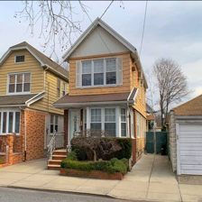
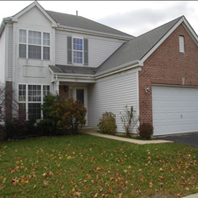
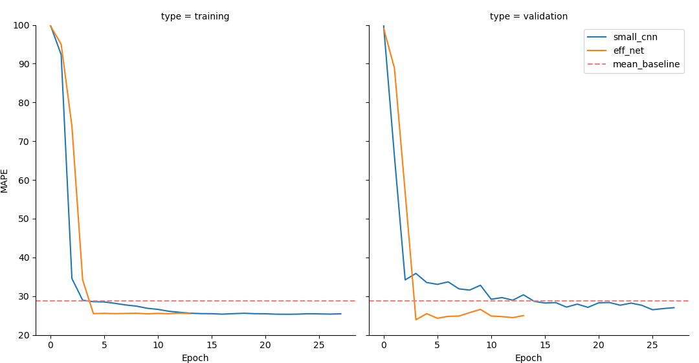

There are hundreds of tutorials online available on how to use Keras for deep learning. But at least to my impression, 99% of them just use the easy to use MNIST dataset and some form of a small custom convolutional neural network or ResNet for classification. I personally dislike the general idea of always using the easiest dataset for machine learning and deep learning tutorials, since this leaves a lot of important questions unanswered. Adapting these tutorials to a custom dataset for a regression problem can be a daunting and time consuming tasks with hours of Googling and reading old StackOverflow questions as well as the official Keras documentation. Through this tutorial I want to show you how you can use a custom dataset and use transfer learning to get great results with very little training time. The following topics will be part of this tutorial:

- use ImageDataGenerators and Pandas DataFrames to load your custom dataset
- augment your image to improve prediction results
- plot augmentations
- adapt the state-of-the-art EfficientNet to a regression target
- use the new Ranger optimizer from `tensorflow_addons`
- compare the EfficientNet results to a simpler custom convolutional neural network

For this, I have uploaded a custom image dataset of housing prices in New York with a corresponding DataFrame with a few columns of information about the houses. The dataset consists of 10,900 images that I have already resized to 224x224 pixels. The full code of this tutorial can be found in the GitHub Repository.

## Table of Contents

- [Table of Contents](#table-of-contents)
- [Preliminary Steps](#preliminary-steps)
  - [Real Estate Data](#real-estate-data)
  - [Installation and Setup](#installation-and-setup)
- [TODO](#todo)

## Preliminary Steps

### Real Estate Data

|                                                   | zpid     | price     | latitude  | longitude  | beds | baths | area   |
| ------------------------------------------------- | -------- | --------- | --------- | ---------- | ---- | ----- | ------ |
|  | 29777854 | 435000.0  | 40.826804 | -73.917024 | 3.0  | 2.0   | 1728.0 |
| ...                                               | ...      | ...       | ...       | ...        | ...  | ...   | ...    |
|  | 30742835 | 888000.0  | 40.603546 | -73.938332 | 3.0  | 3.0   | 1264.0 |
|  | 30742959 | 1160000.0 | 40.599407 | -73.959058 | 3.0  | 2.0   | 1564.0 |
|   | 5409160  | 257825.0  | 40.760407 | -73.796344 | 4.0  | 3.0   | 2100.0 |

### Installation and Setup

- load libraries
- python version
- keras version
- tenesorflow version

```bash
python -m venv /path/to/new/virtual/env
cd /path/to/new/virtual/env/Scripts/
activate.bat
pip install -r /path/to/requirements.txt
```

```bash
wget https://storage.googleapis.com/cloud-tpu-checkpoints/efficientnet/noisystudent/noisy_student_efficientnet-b0.tar.gz

tar -xf noisy_student_efficientnet-b0.tar.gz

python efficientnet_weight_update_util.py --model b0 --notop --ckpt noisy_student_efficientnet-b0/model.ckpt --o efficientnetb0_notop.h5
```

```python
from typing import Iterator, List, Union, Tuple
from datetime import datetime
import pandas as pd
import matplotlib.pyplot as plt
import seaborn as sns
from sklearn.model_selection import train_test_split

from tensorflow import keras
import tensorflow_addons as tfa
from tensorflow.keras.preprocessing.image import ImageDataGenerator
from tensorflow.keras import layers, models, Model
from tensorflow.python.keras.callbacks import TensorBoard, EarlyStopping, ModelCheckpoint
from tensorflow.keras.losses import MeanAbsoluteError, MeanAbsolutePercentageError
from tensorflow.keras.models import Sequential
from tensorflow.keras.applications import EfficientNetB0
from tensorflow.keras.utils import plot_model
from tensorflow.keras.callbacks import History
```

```python

def run():
    """Run all the code of this file."""

    df = pd.read_pickle("./data/df.pkl")
    df["image_location"] = (
        "./data/processed_images/" + df["zpid"] + ".png"
    )  # add the correct path for the image locations.
    # df = df.iloc[0:1000] # uncomment this if you want to check if your code works without long waiting times
if __name__ == "__main__":
    run()

```




## TODO

- add flowchart of whole code
- write all chapters
- upload data
- grammarly
- requrirements.txt
- add small cnn flowchart
- link big efficient net flowchart (github)
- write github readme and link to blog
