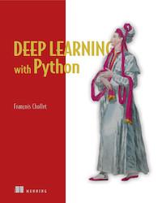

As I'm nearing the end of my time as a Ph.D. student, I was wondering how I would approach it differently if I had the chance to do so. I have bachelor's and master's degrees in Economics, so my knowledge in programming and data science was limited before entering a Ph.D. program in information systems with an intense focus on applied machine learning. Thus, I had to work intensely on brushing up my programming, machine learning, and deep learning skills in a short amount of time on my own.

The sheer amount of available books, courses, and tutorials on data science can be overwhelming. In this blog post, I collected all the material that, in my personal opinion, gives a great introduction to python programming, data preprocessing, machine learning as well as data engineering. If anyone has additional recommendations, please post them in the comments with a short explanation of why you found them helpful!

## Table of Contents

- [Table of Contents](#table-of-contents)
- [General Introduction to CS and Programming](#general-introduction-to-cs-and-programming)
  - [Introduction to Python Programming](#introduction-to-python-programming)
    - [Automate the Boring Stuff](#automate-the-boring-stuff)
    - [Python for absolute beginners](#python-for-absolute-beginners)
  - [Linux, VSCode, Git, Docker and Containerization](#linux-vscode-git-docker-and-containerization)
    - [The Missing Semester of Your CS Education](#the-missing-semester-of-your-cs-education)
    - [Setting up VSCode for Data Science](#setting-up-vscode-for-data-science)
    - [Docker for Machine Learning](#docker-for-machine-learning)
  - [Databases](#databases)
- [Introduction to Machine Learning, Deep Learning and Explainable AI](#introduction-to-machine-learning-deep-learning-and-explainable-ai)
  - [Data Preprocessing in Python](#data-preprocessing-in-python)
  - [Data Visualization](#data-visualization)
    - [Fundamentals of Data Visualization](#fundamentals-of-data-visualization)
    - [Scientific Visualization - Python & Matplotlib](#scientific-visualization---python--matplotlib)
    - [Streamlit](#streamlit)
    - [Quarto](#quarto)
  - [Statistics](#statistics)
    - [Statistical Rethinking: A Bayesian Course with Examples in R and STAN](#statistical-rethinking-a-bayesian-course-with-examples-in-r-and-stan)
  - [Machine Learning](#machine-learning)
    - [Hands-On Machine Learning with Scikit-Learn, Keras, and TensorFlow, 2nd Edition](#hands-on-machine-learning-with-scikit-learn-keras-and-tensorflow-2nd-edition)
    - [Applied Predictive Modelling](#applied-predictive-modelling)
  - [Deep Learning](#deep-learning)
    - [Deep Learning with Python (keras)](#deep-learning-with-python-keras)
    - [Practical Deep Learning Course (FastAI)](#practical-deep-learning-course-fastai)
  - [Explainable AI](#explainable-ai)
    - [Interpretable Machine Learning - A Guide for Making Black Box Models Explainable](#interpretable-machine-learning---a-guide-for-making-black-box-models-explainable)
    - [Alibi Explain](#alibi-explain)
    - [Shapley](#shapley)
    - [InterpretML](#interpretml)
  - [Hyperparameter tuning](#hyperparameter-tuning)

## General Introduction to CS and Programming

I'll start with a general introduction to applied computer science and programming. An excellent technical understanding of the underlying basics will pay 10x later when working with highly complex data, libraries, and concepts.

### Introduction to Python Programming

Python is still the #1 programming language for machine learning and data science in general. Other languages in this area are R and Julia, which are great for different reasons. Still, they do not come close to the vast amount of libraries and the overall large Python community online.

#### Automate the Boring Stuff

I personally learned Python programming a few years ago with a printed edition of [Automate the Boring Stuff with Python](https://automatetheboringstuff.com/). It is an excellent introduction to programming due to the shallow entry barrier and steady learning curve. Still, it does not shy away from more complex examples and gives beginners a chance to play around with python code on their own.

#### Python for absolute beginners

[Python for absolute Beginners](https://www.youtube.com/watch?v=mDKM-JtUhhc) is a great recommendation for people who learn better with a video course and a lecturer. It is a free 11-hour course covering the same programming principles as Automate the boring Stuff.

### Linux, VSCode, Git, Docker and Containerization

A basic understanding of Linux, Git, and Containerization with Docker and VSCode as an editor might seem too much for any new data science learners. Still, it is one of the most essential basics to get work done efficiently later in your career. In addition, code reproducibility and working in a team through Git/Github are invaluable skills.

#### The Missing Semester of Your CS Education

[The Missing Semester of Your CS Education](https://missing.csail.mit.edu/)

As you get more advanced in your data science career, you will inevitably get in touch with Linux as an operating system on some remote server or working station. The missing semester of your CS education teaches the basics of working in a shell terminal, version control with Git, and code debugging.

#### Setting up VSCode for Data Science

I have used VSCode as my primary code editor for years and would always recommend it as the first and only choice for new data scientists. As with Python, the community around VSCode is vast, and everything you would ever need regarding programming is either already implemented in the editor or available as extensions. In addition, the ability to remotely program on workstations via SSH or even within docker containers has been insanely valuable and time-saving for me.

These three tutorials help you get started with Python, Data Science and remote development with VSCode:

- [Getting Started with Python in VS Code](https://code.visualstudio.com/docs/python/python-tutorial)
- [Data Science in VS Code tutorial](https://code.visualstudio.com/docs/datascience/data-science-tutorial)

- [VS Code Remote Development](https://code.visualstudio.com/docs/remote/remote-overview)

A few extensions I would always recommend:

- [autoDocstring](https://marketplace.visualstudio.com/items?itemName=njpwerner.autodocstring): automatically generates docstring templates for your Python functions.
- [Better Comments](https://marketplace.visualstudio.com/items?itemName=aaron-bond.better-comments): Highlights comments in specific colors through keywords.
- [Prettier](https://marketplace.visualstudio.com/items?itemName=esbenp.prettier-vscode): Automatic code formatting, combined with [Black](https://github.com/psf/black) as a formatter, I have never thought about code formatting again.
- [Rainbow CSV](https://marketplace.visualstudio.com/items?itemName=mechatroner.rainbow-csv): You will work with CSV data a lot as a data scientist. This exertion color codes your columns to make reading data easier
- [Markdown All in One](https://marketplace.visualstudio.com/items?itemName=yzhang.markdown-all-in-one) and [Markdown Preview Enhanced](https://marketplace.visualstudio.com/items?itemName=shd101wyy.markdown-preview-enhanced) are instrumental when working with a lot of markdown files.

#### Docker for Machine Learning

- envornments and versioning in python are a nightmare
- tensorflow running is a nightmare
- code needs to be reproducable
- code sharing and collarberative programming are important
- docker solves these problems

- [Why use Docker containers for Machine Learning?](https://towardsdatascience.com/why-using-docker-for-machine-learning-74c927ceb6c4)
- [Learn to build and deploy your distributed applications easily to the cloud with Docker](https://docker-curriculum.com/)
- [Build and Run a Docker Container for your Machine Learning Model](https://towardsdatascience.com/build-and-run-a-docker-container-for-your-machine-learning-model-60209c2d7a7f)
-

### Databases

- [Introduction to PostgreSQL](https://www.postgresqltutorial.com/)

- [Introduction to SQLite](https://www.sqlitetutorial.net/)

## Introduction to Machine Learning, Deep Learning and Explainable AI

### Data Preprocessing in Python

- [Python for Data Analysis, 3rd Edition](https://wesmckinney.com/book/)

### Data Visualization

#### Fundamentals of Data Visualization

- https://clauswilke.com/dataviz/

#### Scientific Visualization - Python & Matplotlib

- https://github.com/rougier/scientific-visualization-book

#### Streamlit

- https://streamlit.io/

#### Quarto

https://quarto.org/

### Statistics

#### Statistical Rethinking: A Bayesian Course with Examples in R and STAN

- [Statistical Rethinking: A Bayesian Course with Examples in R and STAN](https://www.amazon.com/dp/036713991X)
- https://fehiepsi.github.io/rethinking-numpyro/

### Machine Learning

#### Hands-On Machine Learning with Scikit-Learn, Keras, and TensorFlow, 2nd Edition

- [Hands-On Machine Learning with Scikit-Learn, Keras, and TensorFlow, 2nd Edition](https://www.oreilly.com/library/view/hands-on-machine-learning/9781492032632/)

#### Applied Predictive Modelling

- [Applied Predictive Modelling](https://www.amazon.com/dp/1461468485/)

### Deep Learning

#### Deep Learning with Python (keras)

- [Deep Learning with Python](https://www.manning.com/books/deep-learning-with-python)

#### Practical Deep Learning Course (FastAI)

- f[astai course](https://course.fast.ai/)

### Explainable AI

#### Interpretable Machine Learning - A Guide for Making Black Box Models Explainable

- [Interpretable Machine Learning A Guide for Making Black Box Models Explainable](https://christophm.github.io/interpretable-ml-book/)

#### Alibi Explain

- [Alibi Explain is an open source Python library aimed at machine learning model inspection and interpretation](https://docs.seldon.io/projects/alibi/en/stable/overview/high_level.html)

#### Shapley

- [An introduction to explainable AI with Shapley values](https://shap.readthedocs.io/en/latest/example_notebooks/overviews/An%20introduction%20to%20explainable%20AI%20with%20Shapley%20values.html)

#### InterpretML

- [InterpretML Fit interpretable models. Explain blackbox machine learning.](https://github.com/interpretml/interpret)

### Hyperparameter tuning

https://optuna.org/
https://optuna.readthedocs.io/en/stable/tutorial/index.html
